# 🎨 Архитектурная Визуализация Проекта

> **Комплексное визуальное представление проекта systech-aidd с использованием различных типов диаграмм**

## 📋 Содержание

1. [Контекстная диаграмма (C4 Context)](#1-контекстная-диаграмма-c4-context)
2. [Компонентная архитектура](#2-компонентная-архитектура)
3. [Диаграмма классов](#3-диаграмма-классов)
4. [Диаграмма последовательности](#4-диаграмма-последовательности-sequence)
5. [Диаграмма состояний](#5-диаграмма-состояний-state)
6. [Поток данных (Data Flow)](#6-поток-данных-data-flow)
7. [Жизненный цикл сообщения](#7-жизненный-цикл-сообщения)
8. [Обработка ошибок](#8-обработка-ошибок-error-handling)
9. [User Journey (Путь пользователя)](#9-user-journey-путь-пользователя)
10. [Deployment Architecture](#10-deployment-architecture)
11. [Структура хранения данных](#11-структура-хранения-данных)
12. [CI/CD Pipeline](#12-cicd-pipeline)

---

## 1. Контекстная диаграмма (C4 Context)

**Точка зрения:** Внешний наблюдатель - как система взаимодействует с внешним миром

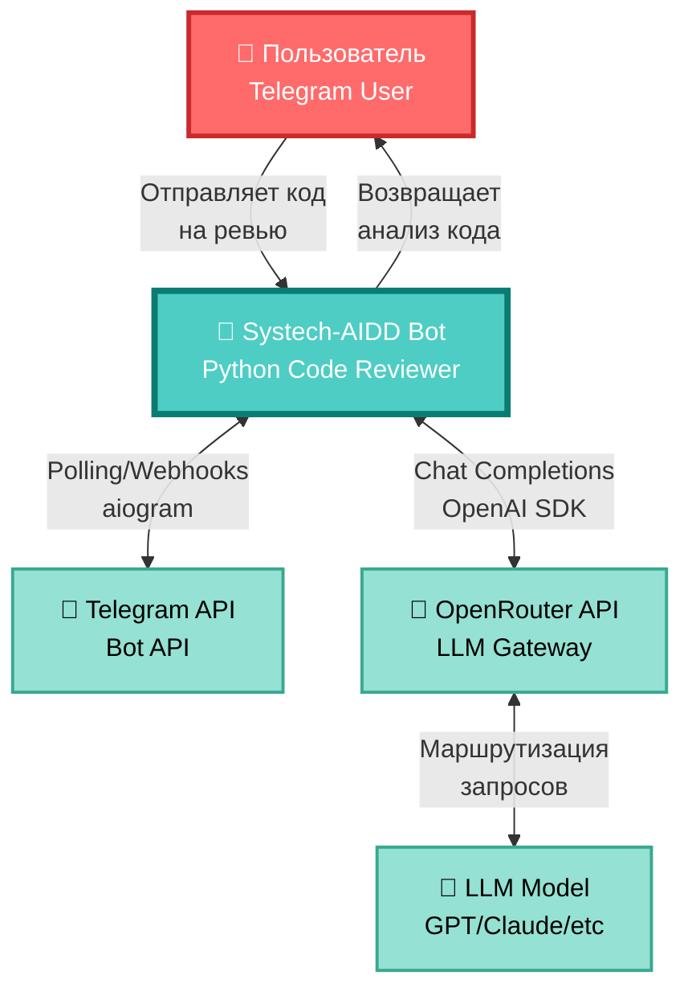

### Описание взаимодействий:
- **Пользователь → Bot**: Отправка Python кода для анализа через Telegram
- **Bot ↔ Telegram API**: Двунаправленное взаимодействие через polling (aiogram)
- **Bot ↔ OpenRouter**: HTTP запросы через OpenAI SDK
- **OpenRouter ↔ LLM**: Маршрутизация к различным LLM провайдерам

---

## 2. Компонентная архитектура

**Точка зрения:** Разработчик - внутренняя структура приложения

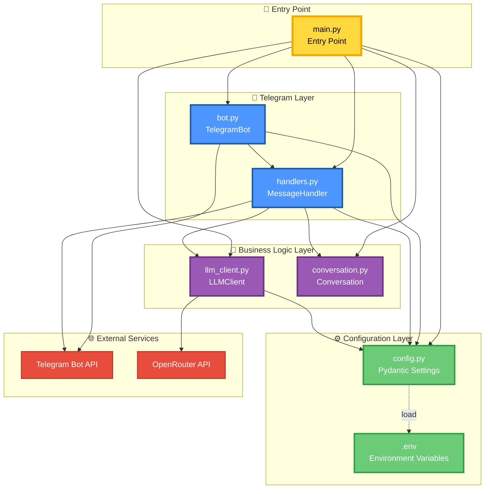

### Слои приложения:
- **Entry Point**: Точка входа и инициализация
- **Configuration**: Управление конфигурацией через Pydantic
- **Telegram Layer**: Взаимодействие с Telegram Bot API
- **Business Logic**: Обработка диалогов и LLM запросов
- **External Services**: Внешние API

---

## 3. Диаграмма классов

**Точка зрения:** Архитектор - структура объектов и их отношения

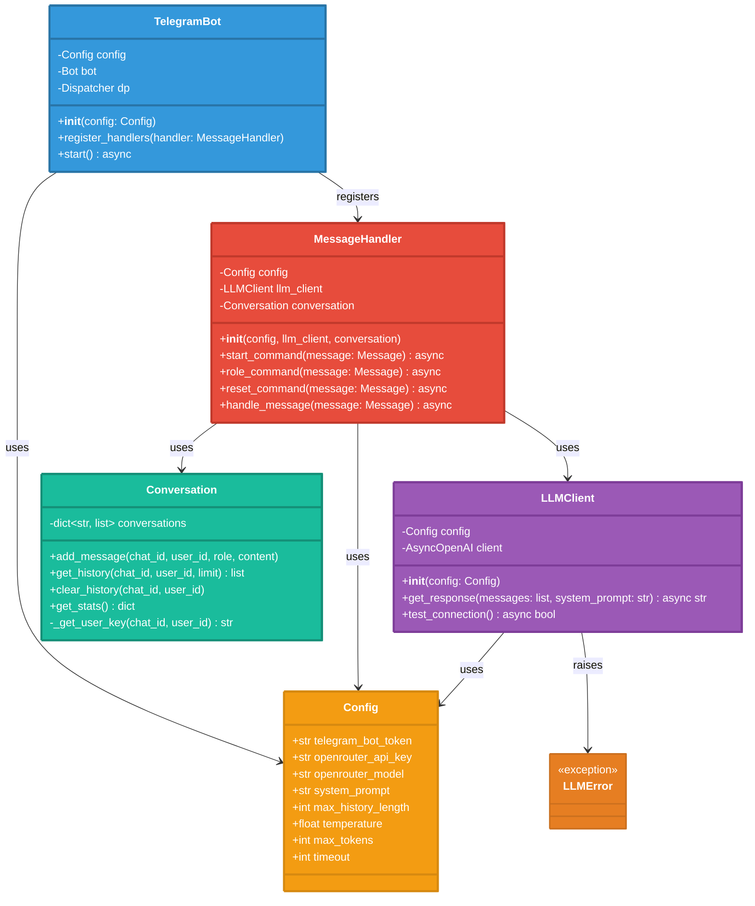

### Паттерны проектирования:
- **Single Responsibility**: Каждый класс имеет одну ответственность
- **Dependency Injection**: Config передается в конструкторы
- **Composition over Inheritance**: Композиция объектов вместо наследования

---

## 4. Диаграмма последовательности (Sequence)

**Точка зрения:** Разработчик - как компоненты взаимодействуют во времени

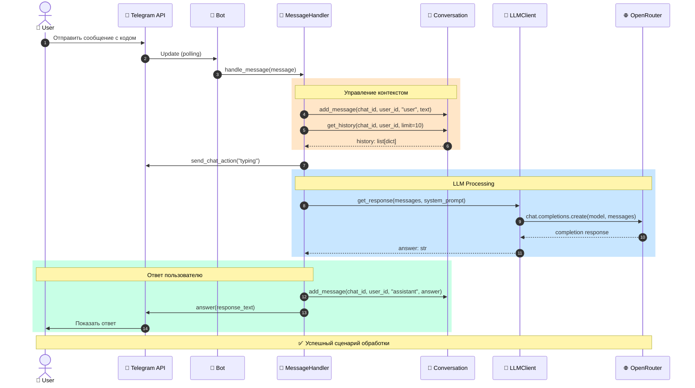

### Ключевые этапы:
1. **Получение сообщения**: Telegram API → Bot → Handler
2. **Управление контекстом**: Добавление в историю + получение контекста
3. **LLM Processing**: Запрос к OpenRouter и получение ответа
4. **Ответ пользователю**: Сохранение в историю + отправка через Telegram

---

## 5. Диаграмма состояний (State)

**Точка зрения:** Аналитик - жизненный цикл диалога

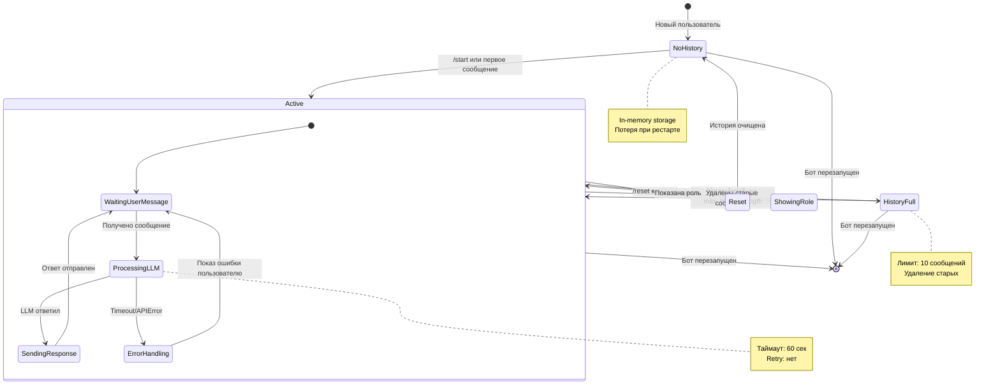

### Состояния системы:
- **NoHistory**: Новый пользователь без истории
- **Active**: Активный диалог с пользователем
- **ProcessingLLM**: Обработка запроса к LLM
- **ErrorHandling**: Обработка ошибок API
- **HistoryFull**: Превышен лимит истории
- **Reset**: Сброс истории диалога
- **ShowingRole**: Отображение роли бота

---

## 6. Поток данных (Data Flow)

**Точка зрения:** Data Engineer - как данные трансформируются в системе

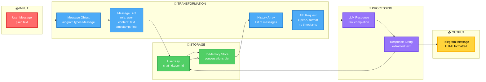

### Трансформации данных:
1. **Input**: Текст от пользователя
2. **Message Object**: aiogram Message с метаданными
3. **Message Dict**: Структура с role/content/timestamp
4. **Storage**: Сохранение в in-memory словарь
5. **History Array**: Список сообщений для контекста
6. **API Request**: Формат OpenAI (без timestamp)
7. **LLM Response**: Ответ от модели
8. **Output**: HTML-форматированное сообщение

---

## 7. Жизненный цикл сообщения

**Точка зрения:** DevOps - путь сообщения через систему

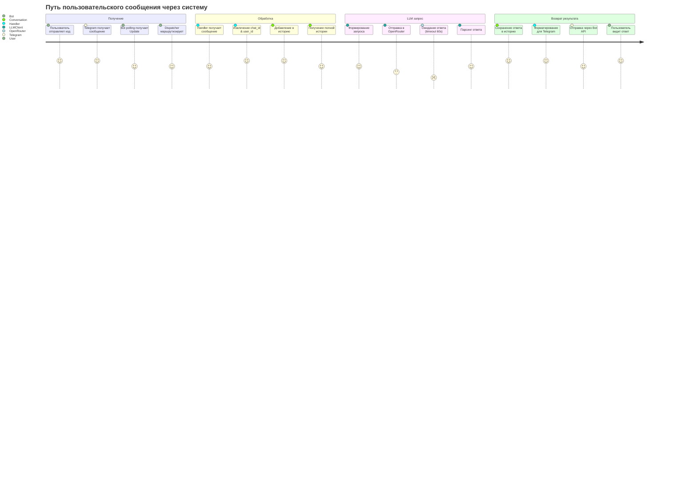

### Этапы обработки:
- **Получение**: 0-2 сек (зависит от polling interval)
- **Обработка**: < 100 мс (in-memory операции)
- **LLM запрос**: 2-60 сек (зависит от модели и нагрузки)
- **Возврат результата**: < 500 мс

---

## 8. Обработка ошибок (Error Handling)

**Точка зрения:** QA Engineer - потоки обработки ошибок

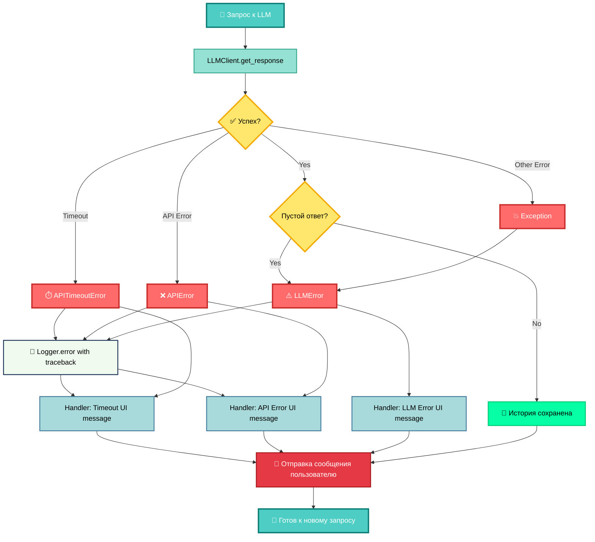

### Типы ошибок и их обработка:

| Ошибка | Источник | Обработчик | Действие |
|--------|----------|------------|----------|
| `APITimeoutError` | OpenRouter | MessageHandler | "⏱️ Превышено время ожидания (60с)" |
| `APIError` | OpenRouter | MessageHandler | "❌ Ошибка API: {details}" |
| `LLMError` | LLMClient | MessageHandler | "⚠️ Ошибка LLM: {details}" |
| `Exception` | Любой | MessageHandler | "💥 Непредвиденная ошибка" |

---

## 9. User Journey (Путь пользователя)

**Точка зрения:** UX Designer - взаимодействие с ботом

```mermaid
graph TD
    Start([👤 Пользователь открывает бота]):::userStyle
    
    StartCmd[/start - Приветствие]:::cmdStyle
    Welcome["👋 Привет! Я Python Code Reviewer<br/>💡 Команды: /role, /reset"]:::msgStyle
    
    Choice1{Что делать?}:::choiceStyle
    
    RoleCmd[/role - Узнать о роли]:::cmdStyle
    RoleInfo["🎭 Моя роль: Python Code Reviewer<br/>📋 Специализация:<br/>• PEP 8 проверка<br/>• Поиск багов<br/>• Советы по рефакторингу"]:::msgStyle
    
    SendCode[📝 Отправить Python код]:::actionStyle
    Typing[⌨️ Bot typing...]:::processStyle
    Review["✅ Анализ кода:<br/>1. Соответствие PEP 8<br/>2. Потенциальные баги<br/>3. Рекомендации"]:::msgStyle
    
    Continue{Продолжить?}:::choiceStyle
    
    MoreCode[📝 Отправить еще код]:::actionStyle
    ResetCmd[/reset - Новый диалог]:::cmdStyle
    ResetMsg["🔄 История очищена!"]:::msgStyle
    
    Exit([👋 Пользователь закрывает чат]):::endStyle

    Start --> StartCmd
    StartCmd --> Welcome
    Welcome --> Choice1
    
    Choice1 -->|"Узнать больше"| RoleCmd
    RoleCmd --> RoleInfo
    RoleInfo --> Choice1
    
    Choice1 -->|"Отправить код"| SendCode
    SendCode --> Typing
    Typing --> Review
    Review --> Continue
    
    Continue -->|"Да"| MoreCode
    MoreCode --> Typing
    
    Continue -->|"Сбросить"| ResetCmd
    ResetCmd --> ResetMsg
    ResetMsg --> Choice1
    
    Continue -->|"Выход"| Exit

    classDef userStyle fill:#FF6B6B,stroke:#C92A2A,stroke-width:4px,color:#FFF
    classDef cmdStyle fill:#4DABF7,stroke:#1971C2,stroke-width:3px,color:#FFF
    classDef msgStyle fill:#51CF66,stroke:#2F9E44,stroke-width:2px,color:#FFF
    classDef choiceStyle fill:#FFD43B,stroke:#FAB005,stroke-width:3px,color:#000
    classDef actionStyle fill:#9775FA,stroke:#7048E8,stroke-width:2px,color:#FFF
    classDef processStyle fill:#FFA94D,stroke:#FD7E14,stroke-width:2px,color:#FFF
    classDef endStyle fill:#868E96,stroke:#495057,stroke-width:3px,color:#FFF
```

### Основные сценарии:
1. **Онбординг**: `/start` → Приветствие → `/role` → Понимание возможностей
2. **Основной флоу**: Отправка кода → Ожидание → Получение ревью → Повтор
3. **Сброс контекста**: `/reset` → Новый диалог

---

## 10. Deployment Architecture

**Точка зрения:** DevOps - развертывание и инфраструктура

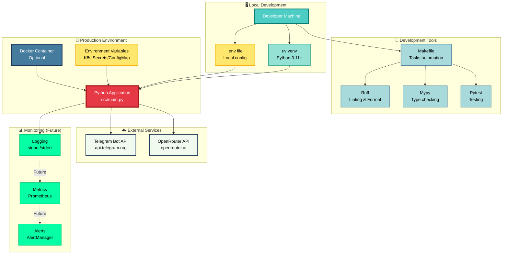

### Окружения:
- **Local Development**: Разработка на локальной машине с uv
- **Production**: Опционально Docker + Kubernetes
- **External Services**: Telegram и OpenRouter API
- **Monitoring**: Логирование (текущее) + метрики (будущее)

---

## 11. Структура хранения данных

**Точка зрения:** Data Architect - организация данных в памяти

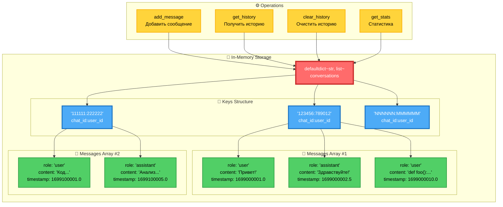

### Структура данных:
```python
conversations: defaultdict[str, list[dict[str, Any]]] = {
    "chat_id:user_id": [
        {
            "role": "user",
            "content": "message text",
            "timestamp": 1699000001.0
        },
        ...
    ]
}
```

### Особенности:
- **In-Memory**: Все в RAM, нет персистентности
- **Composite Key**: `chat_id:user_id` для разделения пользователей
- **Timestamp**: Для каждого сообщения (отладка/логирование)
- **Auto-Initialize**: defaultdict автоматически создает пустые списки

---

## 12. CI/CD Pipeline

**Точка зрения:** DevOps - процесс проверки качества кода

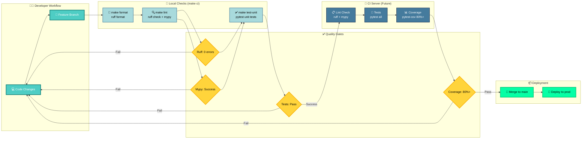

### Этапы проверки:
1. **Local Checks**: `make ci` перед коммитом
   - Ruff format + check (0 errors)
   - Mypy strict mode (100% typed)
   - Unit tests (не требуют .env)

2. **CI Server** (планируется):
   - Все локальные проверки
   - Интеграционные тесты
   - Coverage report (цель: 80%+)

3. **Quality Gates**:
   - Ruff: 0 ошибок ✅
   - Mypy: Success ✅
   - Tests: All pass ✅
   - Coverage: 81% ✅

---

## 📊 Метрики и KPI

### Производительность:
- **Response Time**: 2-10 сек (зависит от LLM)
- **Polling Interval**: По умолчанию aiogram (пуши в реальном времени)
- **Memory Usage**: ~50 MB + история диалогов
- **Timeout**: 60 сек для LLM запросов

### Качество кода:
- **Ruff**: 0 ошибок ✅
- **Mypy**: 100% типизация ✅
- **Test Coverage**: 81% ✅
- **Lines of Code**: ~700 LOC (включая тесты)

### Архитектурные метрики:
- **Modules**: 6 core modules
- **Classes**: 5 main classes
- **Dependencies**: 6 основных библиотек
- **Complexity**: Low (KISS принцип)

---

## 🎯 Выводы

### Архитектурные преимущества:

1. **Простота** (KISS):
   - Минимум абстракций
   - Прямолинейный поток данных
   - Понятные зависимости

2. **Модульность**:
   - Четкое разделение ответственности (SRP)
   - Независимые компоненты
   - Легкая тестируемость

3. **Гибкость**:
   - Ролевая модель через промпты
   - Конфигурация через .env
   - Легко расширяемая архитектура

4. **Качество**:
   - 100% типизация (mypy strict)
   - 81% покрытие тестами
   - Автоматизированные проверки

### Области для улучшения:

1. **Персистентность**: Добавить БД для сохранения истории
2. **Масштабируемость**: Redis для распределенного хранилища
3. **Мониторинг**: Prometheus + Grafana метрики
4. **Deployment**: Docker + Kubernetes
5. **Testing**: Увеличить покрытие до 95%+

---

## 📚 Связанные документы

- [README.md](../README.md) - Основная документация
- [vision.md](./vision.md) - Техническое видение
- [idea.md](./idea.md) - Концепция проекта
- [Guides](./guides/README.md) - Полный набор гайдов для разработчиков
- [conventions.mdc](../.cursor/rules/conventions.mdc) - Соглашения по коду
- [workflow_tdd.mdc](../.cursor/rules/workflow_tdd.mdc) - TDD процесс

---

**Создано:** 2025-10-16  
**Версия:** 1.0  
**Статус:** ✅ Актуально


