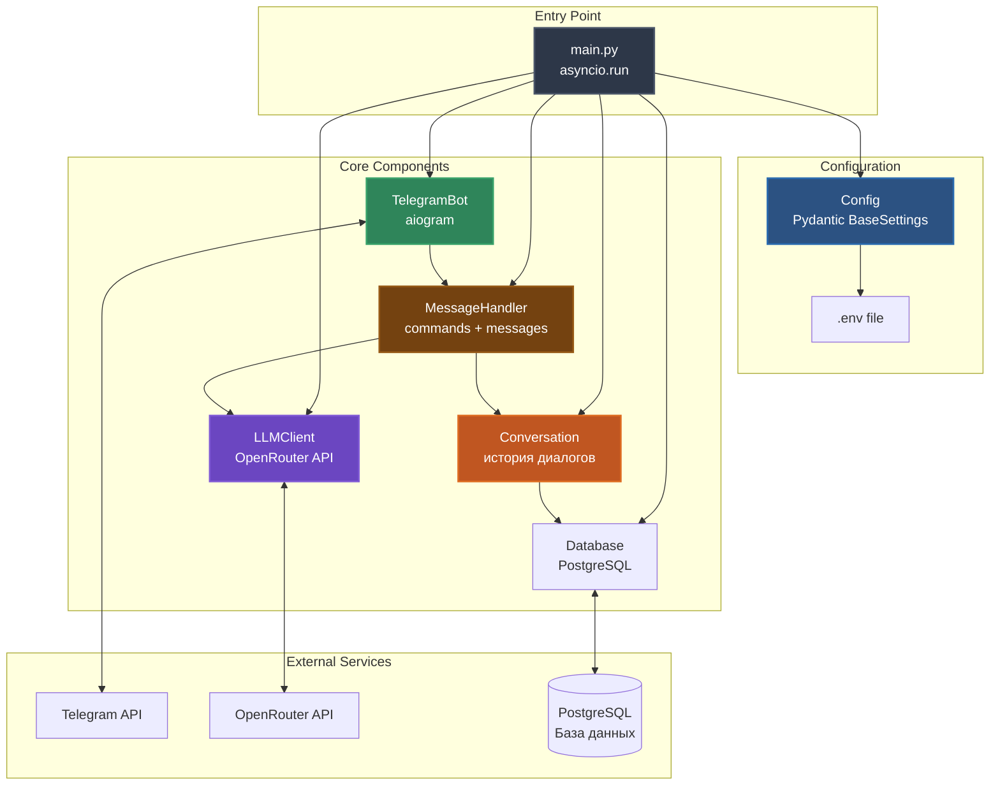
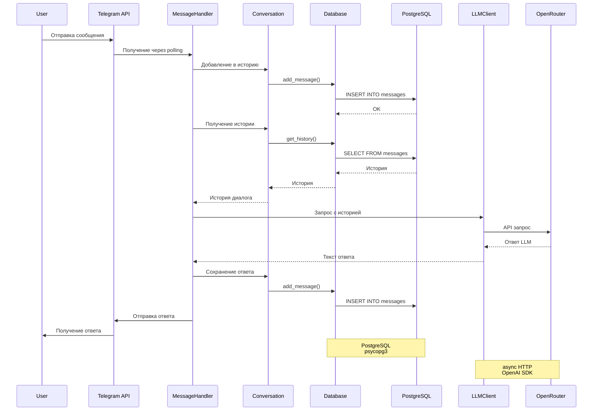
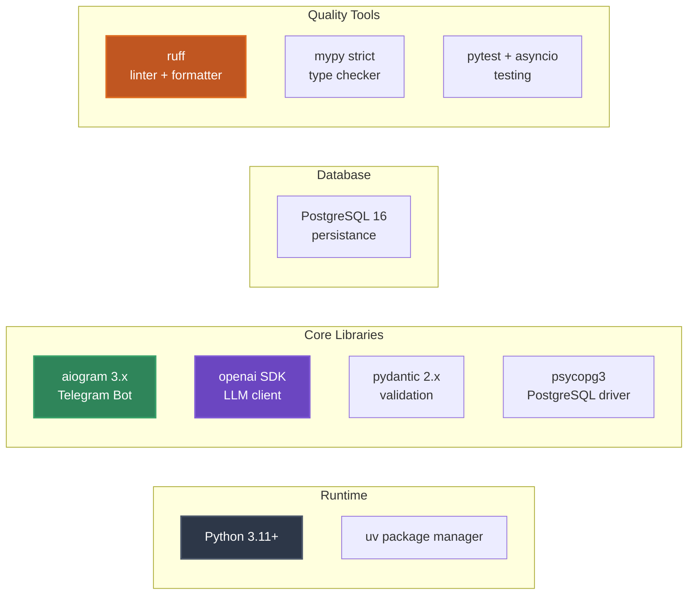
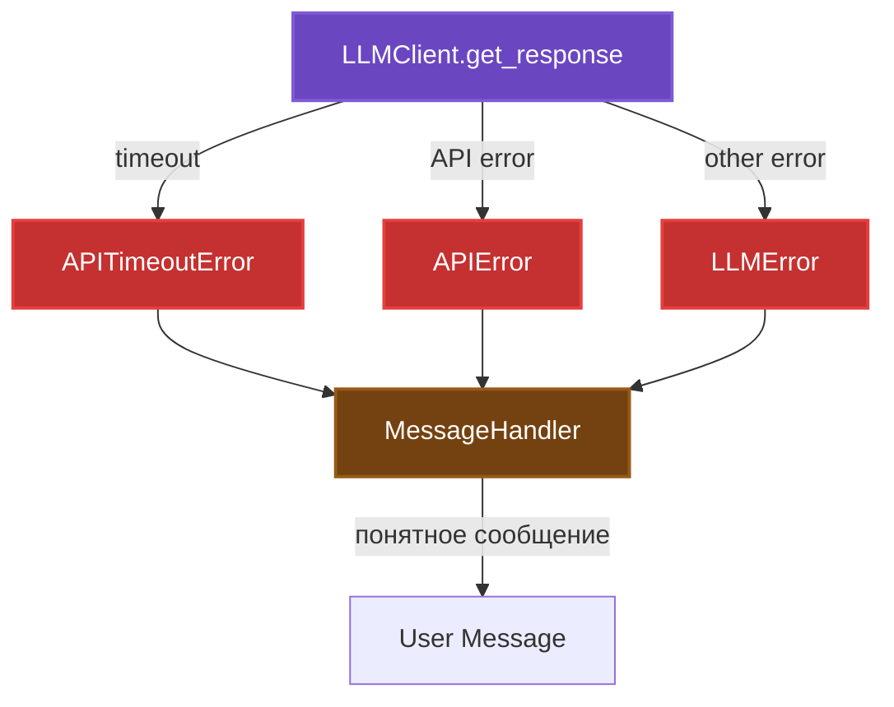

# Architecture Overview

Обзор high-level архитектуры проекта. Понимание принципов и компонентов системы.

## Принципы проекта

### Основные принципы

1. **KISS (Keep It Simple, Stupid)** - максимальная простота без избыточных абстракций
2. **ООП** - объектно-ориентированный подход с четкой структурой
3. **1 класс = 1 файл** - каждый класс в отдельном файле
4. **SRP (Single Responsibility)** - каждый класс имеет одну ответственность
5. **Async/await** - асинхронность для всех I/O операций
6. **TDD** - разработка через тестирование

### Антипаттерны (что НЕ делаем)

- ❌ Сложные паттерны проектирования (фабрики, стратегии)
- ❌ Множественные уровни абстракции
- ❌ Преждевременная оптимизация
- ❌ ORM (используем чистый SQL через psycopg3)
- ❌ Retry, streaming, кеширование (пока не нужно)

## Архитектурная схема


```mermaid
graph TB
    subgraph "Entry Point"
        MAIN[main.py<br/>asyncio.run]
    end
    
    subgraph "Configuration"
        CONFIG[Config<br/>Pydantic BaseSettings]
        ENV[.env file]
    end
    
    subgraph "Core Components"
        BOT[TelegramBot<br/>aiogram]
        HANDLER[MessageHandler<br/>commands + messages]
        LLM[LLMClient<br/>OpenRouter API]
        CONV[Conversation<br/>история диалогов]
        DB[Database<br/>PostgreSQL]
    end
    
    subgraph "External Services"
        TELEGRAM[Telegram API]
        OPENROUTER[OpenRouter API]
        POSTGRES[(PostgreSQL<br/>База данных)]
    end
    
    MAIN --> CONFIG
    CONFIG --> ENV
    MAIN --> BOT
    MAIN --> HANDLER
    MAIN --> LLM
    MAIN --> CONV
    MAIN --> DB
    
    BOT --> HANDLER
    HANDLER --> LLM
    HANDLER --> CONV
    CONV --> DB
    
    BOT <--> TELEGRAM
    LLM <--> OPENROUTER
    DB <--> POSTGRES
    
    style MAIN fill:#2d3748,stroke:#4a5568,stroke-width:2px,color:#fff
    style CONFIG fill:#2c5282,stroke:#2b6cb0,stroke-width:2px,color:#fff
    style BOT fill:#2f855a,stroke:#38a169,stroke-width:2px,color:#fff
    style HANDLER fill:#744210,stroke:#975a16,stroke-width:2px,color:#fff
    style LLM fill:#6b46c1,stroke:#805ad5,stroke-width:2px,color:#fff
    style CONV fill:#c05621,stroke:#dd6b20,stroke-width:2px,color:#fff
```

## Поток данных


```mermaid
sequenceDiagram
    participant U as User
    participant T as Telegram API
    participant H as MessageHandler
    participant C as Conversation
    participant DB as Database
    participant PG as PostgreSQL
    participant L as LLMClient
    participant O as OpenRouter

    U->>T: Отправка сообщения
    T->>H: Получение через polling
    H->>C: Добавление в историю
    C->>DB: add_message()
    DB->>PG: INSERT INTO messages
    PG-->>DB: OK
    H->>C: Получение истории
    C->>DB: get_history()
    DB->>PG: SELECT FROM messages
    PG-->>DB: История
    DB-->>C: История
    C-->>H: История диалога
    H->>L: Запрос с историей
    L->>O: API запрос
    O-->>L: Ответ LLM
    L-->>H: Текст ответа
    H->>C: Сохранение ответа
    C->>DB: add_message()
    DB->>PG: INSERT INTO messages
    H->>T: Отправка ответа
    T->>U: Получение ответа
    
    Note over DB,PG: PostgreSQL<br/>psycopg3
    Note over L,O: async HTTP<br/>OpenAI SDK
```

## Компоненты системы

### main.py - Точка входа

**Ответственность**: Инициализация и запуск приложения

**Функции**:
- Загрузка `.env` через `python-dotenv`
- Создание всех компонентов
- Регистрация обработчиков
- Запуск polling

### config.py - Конфигурация

**Ответственность**: Валидация настроек из `.env`

**Технологии**: Pydantic BaseSettings

**Параметры**:
- Обязательные: токены, ключи, модель, промпт
- Опциональные: температура, max_tokens, timeout, лимит истории

### bot.py - Telegram Bot

**Ответственность**: Инициализация aiogram и регистрация handlers

**Зависимости**: Config

**Функции**:
- Создание Bot и Dispatcher
- Регистрация команд (`/start`, `/role`, `/reset`)
- Регистрация обработчика текстовых сообщений
- Запуск polling

### handlers.py - Обработчики сообщений

**Ответственность**: Логика обработки команд и сообщений

**Зависимости**: Config, LLMClient, Conversation

**Обработчики**:
- `start_command()` - приветствие с описанием роли
- `role_command()` - детали роли и возможностей
- `reset_command()` - очистка истории
- `handle_message()` - обработка текста + error handling

**Обработка ошибок**: Перехват исключений LLM и отправка понятных сообщений пользователю

### llm_client.py - LLM клиент

**Ответственность**: Взаимодействие с OpenRouter API

**Зависимости**: Config

**Технологии**: OpenAI SDK с base_url OpenRouter

**Методы**:
- `get_response()` - отправка запроса к LLM
- `test_connection()` - проверка подключения

**Исключения**: 
- `APITimeoutError` - таймаут
- `APIError` - ошибка API
- `LLMError` - другие ошибки

### database.py - Работа с PostgreSQL

**Ответственность**: Слой работы с базой данных

**Технологии**: psycopg3 (PostgreSQL драйвер)

**Методы**:
- `add_message()` - добавление сообщения в БД
- `get_history()` - получение истории из БД
- `clear_history()` - soft delete сообщений
- `upsert_user()` - создание/обновление пользователя
- `get_user()` - получение информации о пользователе
- `get_user_stats()` - статистика использования

### conversation.py - Управление диалогами

**Ответственность**: Управление историей сообщений через БД

**Хранилище**: PostgreSQL (таблица `messages`)

**Зависимости**: Database

**Методы**:
- `add_message()` - добавление сообщения (делегирует в Database)
- `get_history()` - получение истории с лимитом
- `clear_history()` - очистка истории (soft delete)

## Ролевая модель AI-продукта

### Концепция

Бот не универсальный, а **специализированный** - имеет четкую роль и границы компетенции.

### Текущая роль

**Python Code Reviewer** - эксперт по проверке Python кода

**Специализация**:
- ✅ Проверка PEP 8
- ✅ Поиск багов
- ✅ Советы по рефакторингу
- ✅ Рекомендации по производительности

**Ограничения**:
- ❌ Только Python (не другие языки)
- ❌ Не пишет код за пользователя
- ❌ Не делает редизайн архитектуры без запроса

### Реализация роли

Роль определяется через **системный промпт** в `.env`:

```env
SYSTEM_PROMPT=Ты - Python Code Reviewer. Анализируешь Python код...
```

Команда `/role` отображает детали роли пользователю (прозрачность).

## Технологический стек


```mermaid
graph LR
    subgraph "Runtime"
        PY[Python 3.11+]
        UV[uv package manager]
    end
    
    subgraph "Core Libraries"
        AIOGRAM[aiogram 3.x<br/>Telegram Bot]
        OPENAI[openai SDK<br/>LLM client]
        PYDANTIC[pydantic 2.x<br/>validation]
        PSYCOPG[psycopg3<br/>PostgreSQL driver]
    end
    
    subgraph "Database"
        POSTGRES[PostgreSQL 16<br/>persistance]
    end
    
    subgraph "Quality Tools"
        RUFF[ruff<br/>linter + formatter]
        MYPY[mypy strict<br/>type checker]
        PYTEST[pytest + asyncio<br/>testing]
    end
    
    style PY fill:#2d3748,stroke:#4a5568,stroke-width:2px,color:#fff
    style AIOGRAM fill:#2f855a,stroke:#38a169,stroke-width:2px,color:#fff
    style OPENAI fill:#6b46c1,stroke:#805ad5,stroke-width:2px,color:#fff
    style RUFF fill:#c05621,stroke:#dd6b20,stroke-width:2px,color:#fff
```

### Обоснование выбора

| Технология | Почему выбрана |
|------------|----------------|
| **Python 3.11+** | Современный синтаксис, async/await, type hints |
| **uv** | Быстрый package manager, детерминированные зависимости |
| **aiogram 3.x** | Современный async Telegram фреймворк |
| **openai SDK** | Официальный SDK, совместимый с OpenRouter |
| **pydantic** | Валидация конфигурации, type safety |
| **PostgreSQL 16** | Надежная БД для персистентного хранения |
| **psycopg3** | Современный PostgreSQL драйвер, чистый SQL |
| **ruff** | Быстрый линтер, замена flake8/black/isort |
| **mypy strict** | Гарантия типобезопасности |

## Взаимодействие компонентов

### Принципы

1. **Config** - независимый, используется всеми
2. **Database** - низкоуровневый слой работы с PostgreSQL
3. **TelegramBot** - знает только о Config
4. **LLMClient** - знает только о Config, бросает исключения
5. **MessageHandler** - центральный компонент, обрабатывает ошибки
6. **Conversation** - управляет диалогами через Database

### Разделение ответственности (SRP)

| Компонент | Ответственность |
|-----------|-----------------|
| Database | Работа с PostgreSQL, **чистый SQL** |
| LLMClient | Работа с API, **не знает о UI** |
| MessageHandler | UI логика, **обработка ошибок** |
| Conversation | Управление диалогами, **делегирует в Database** |
| TelegramBot | Инициализация, **не знает о бизнес-логике** |

### Обработка ошибок


```mermaid
graph TD
    LLM[LLMClient.get_response]
    TIMEOUT[APITimeoutError]
    APIERR[APIError]
    LLMERR[LLMError]
    HANDLER[MessageHandler]
    USER[User Message]
    
    LLM -->|timeout| TIMEOUT
    LLM -->|API error| APIERR
    LLM -->|other error| LLMERR
    
    TIMEOUT --> HANDLER
    APIERR --> HANDLER
    LLMERR --> HANDLER
    
    HANDLER -->|понятное сообщение| USER
    
    style LLM fill:#6b46c1,stroke:#805ad5,stroke-width:2px,color:#fff
    style TIMEOUT fill:#c53030,stroke:#e53e3e,stroke-width:2px,color:#fff
    style APIERR fill:#c53030,stroke:#e53e3e,stroke-width:2px,color:#fff
    style LLMERR fill:#c53030,stroke:#e53e3e,stroke-width:2px,color:#fff
    style HANDLER fill:#744210,stroke:#975a16,stroke-width:2px,color:#fff
```

**Принцип**: LLMClient бросает исключения, MessageHandler их перехватывает и показывает пользователю.

## Особенности реализации

### PostgreSQL persistence

История диалогов и пользователей хранится в PostgreSQL:
- ✅ Персистентное хранение (сохраняется между перезапусками)
- ✅ Soft-delete стратегия (deleted_at timestamp)
- ✅ SQL миграции для версионирования схемы
- ✅ Чистый SQL через psycopg3 (без ORM для простоты)
- ✅ Foreign keys и индексы для целостности данных

### Асинхронность

Все I/O операции асинхронные:
- Telegram API (`aiogram`)
- OpenRouter API (`AsyncOpenAI`)
- Обработчики сообщений (`async def`)

### Относительные импорты

Все модули используют относительные импорты:
```python
from .config import Config
from .llm_client import LLMClient
```

Запуск как модуль: `python -m src.main`

## Что дальше?

- [🎨 Архитектурная визуализация](../architecture_visualization.md) - 12 диаграмм с разных точек зрения (C4, Sequence, State, Data Flow и др.)
- [Data Model](03_DATA_MODEL.md) - структуры данных
- [Codebase Tour](05_CODEBASE_TOUR.md) - навигация по коду
- [Development Workflow](08_DEVELOPMENT_WORKFLOW.md) - процесс разработки

