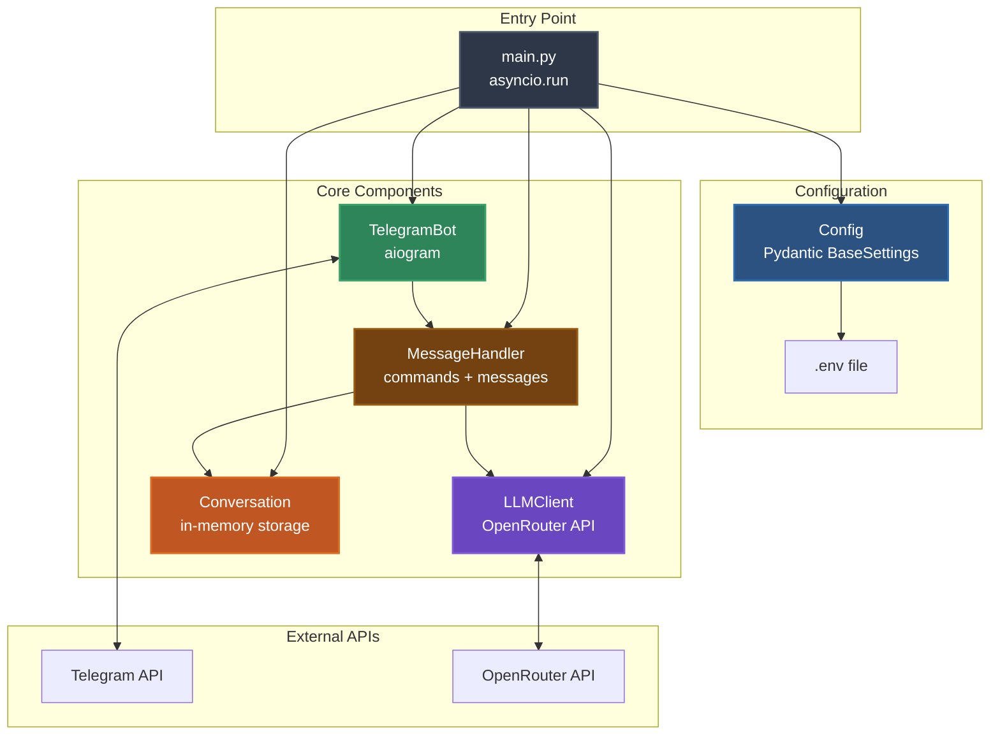
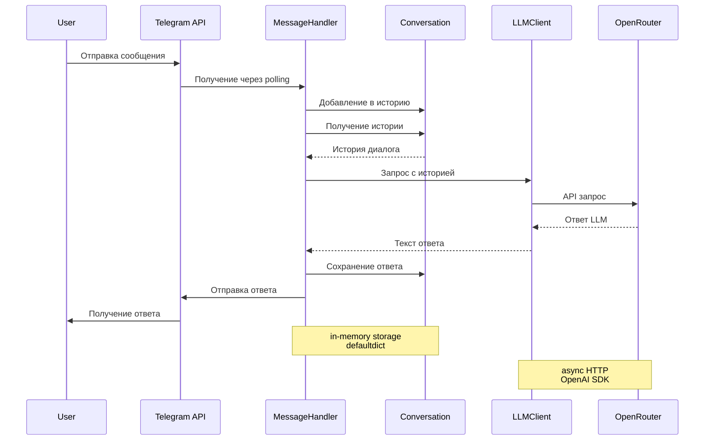
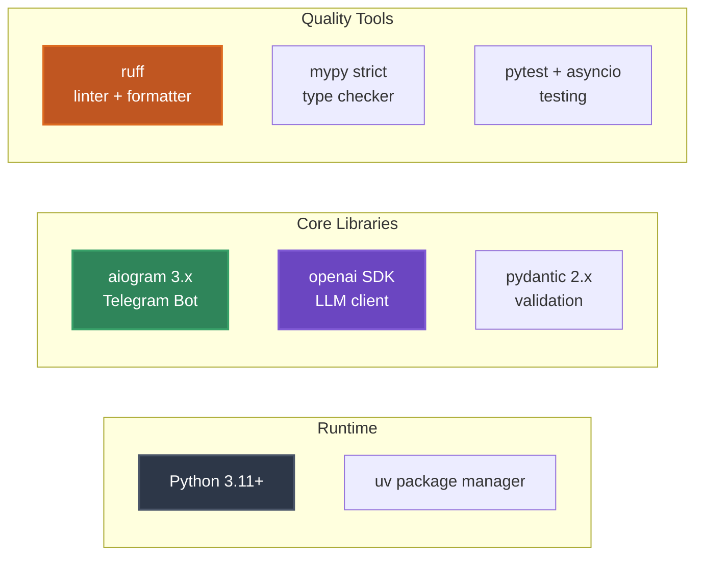

# Architecture Overview

Обзор high-level архитектуры проекта. Понимание принципов и компонентов системы.

## Принципы проекта

### Основные принципы

1. **KISS (Keep It Simple, Stupid)** - максимальная простота без избыточных абстракций
2. **ООП** - объектно-ориентированный подход с четкой структурой
3. **1 класс = 1 файл** - каждый класс в отдельном файле
4. **SRP (Single Responsibility)** - каждый класс имеет одну ответственность
5. **Async/await** - асинхронность для всех I/O операций
6. **TDD** - разработка через тестирование

### Антипаттерны (что НЕ делаем)

- ❌ Сложные паттерны проектирования (фабрики, стратегии)
- ❌ Множественные уровни абстракции
- ❌ Преждевременная оптимизация
- ❌ Базы данных (используем in-memory)
- ❌ Retry, streaming, кеширование (пока не нужно)

## Архитектурная схема



## Поток данных



## Компоненты системы

### main.py - Точка входа

**Ответственность**: Инициализация и запуск приложения

**Функции**:
- Загрузка `.env` через `python-dotenv`
- Создание всех компонентов
- Регистрация обработчиков
- Запуск polling

### config.py - Конфигурация

**Ответственность**: Валидация настроек из `.env`

**Технологии**: Pydantic BaseSettings

**Параметры**:
- Обязательные: токены, ключи, модель, промпт
- Опциональные: температура, max_tokens, timeout, лимит истории

### bot.py - Telegram Bot

**Ответственность**: Инициализация aiogram и регистрация handlers

**Зависимости**: Config

**Функции**:
- Создание Bot и Dispatcher
- Регистрация команд (`/start`, `/role`, `/reset`)
- Регистрация обработчика текстовых сообщений
- Запуск polling

### handlers.py - Обработчики сообщений

**Ответственность**: Логика обработки команд и сообщений

**Зависимости**: Config, LLMClient, Conversation

**Обработчики**:
- `start_command()` - приветствие с описанием роли
- `role_command()` - детали роли и возможностей
- `reset_command()` - очистка истории
- `handle_message()` - обработка текста + error handling

**Обработка ошибок**: Перехват исключений LLM и отправка понятных сообщений пользователю

### llm_client.py - LLM клиент

**Ответственность**: Взаимодействие с OpenRouter API

**Зависимости**: Config

**Технологии**: OpenAI SDK с base_url OpenRouter

**Методы**:
- `get_response()` - отправка запроса к LLM
- `test_connection()` - проверка подключения

**Исключения**: 
- `APITimeoutError` - таймаут
- `APIError` - ошибка API
- `LLMError` - другие ошибки

### conversation.py - Хранилище диалогов

**Ответственность**: Управление историей сообщений

**Хранилище**: `defaultdict[str, list[dict]]` (in-memory)

**Ключ**: `"chat_id:user_id"` - разделение истории по пользователям

**Методы**:
- `add_message()` - добавление сообщения
- `get_history()` - получение истории с лимитом
- `clear_history()` - очистка истории
- `get_stats()` - статистика

## Ролевая модель AI-продукта

### Концепция

Бот не универсальный, а **специализированный** - имеет четкую роль и границы компетенции.

### Текущая роль

**Python Code Reviewer** - эксперт по проверке Python кода

**Специализация**:
- ✅ Проверка PEP 8
- ✅ Поиск багов
- ✅ Советы по рефакторингу
- ✅ Рекомендации по производительности

**Ограничения**:
- ❌ Только Python (не другие языки)
- ❌ Не пишет код за пользователя
- ❌ Не делает редизайн архитектуры без запроса

### Реализация роли

Роль определяется через **системный промпт** в `.env`:

```env
SYSTEM_PROMPT=Ты - Python Code Reviewer. Анализируешь Python код...
```

Команда `/role` отображает детали роли пользователю (прозрачность).

## Технологический стек



### Обоснование выбора

| Технология | Почему выбрана |
|------------|----------------|
| **Python 3.11+** | Современный синтаксис, async/await, type hints |
| **uv** | Быстрый package manager, детерминированные зависимости |
| **aiogram 3.x** | Современный async Telegram фреймворк |
| **openai SDK** | Официальный SDK, совместимый с OpenRouter |
| **pydantic** | Валидация конфигурации, type safety |
| **ruff** | Быстрый линтер, замена flake8/black/isort |
| **mypy strict** | Гарантия типобезопасности |

## Взаимодействие компонентов

### Принципы

1. **Config** - независимый, используется всеми
2. **TelegramBot** - знает только о Config
3. **LLMClient** - знает только о Config, бросает исключения
4. **MessageHandler** - центральный компонент, обрабатывает ошибки
5. **Conversation** - независимый, простое хранилище

### Разделение ответственности (SRP)

| Компонент | Ответственность |
|-----------|-----------------|
| LLMClient | Работа с API, **не знает о UI** |
| MessageHandler | UI логика, **обработка ошибок** |
| Conversation | Хранение данных, **не знает о логике** |
| TelegramBot | Инициализация, **не знает о бизнес-логике** |

### Обработка ошибок


**Принцип**: LLMClient бросает исключения, MessageHandler их перехватывает и показывает пользователю.

## Особенности реализации

### In-memory storage

История диалогов хранится в памяти (`defaultdict`):
- ✅ Простота реализации
- ✅ Быстрый доступ
- ❌ Теряется при перезапуске (это нормально для MVP)

### Асинхронность

Все I/O операции асинхронные:
- Telegram API (`aiogram`)
- OpenRouter API (`AsyncOpenAI`)
- Обработчики сообщений (`async def`)

### Относительные импорты

Все модули используют относительные импорты:
```python
from .config import Config
from .llm_client import LLMClient
```

Запуск как модуль: `python -m src.main`

## Что дальше?

- [Data Model](03_DATA_MODEL.md) - структуры данных
- [Codebase Tour](05_CODEBASE_TOUR.md) - навигация по коду
- [Development Workflow](08_DEVELOPMENT_WORKFLOW.md) - процесс разработки

