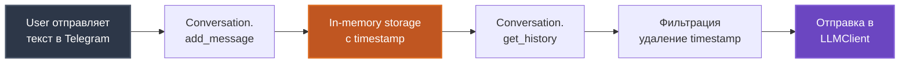
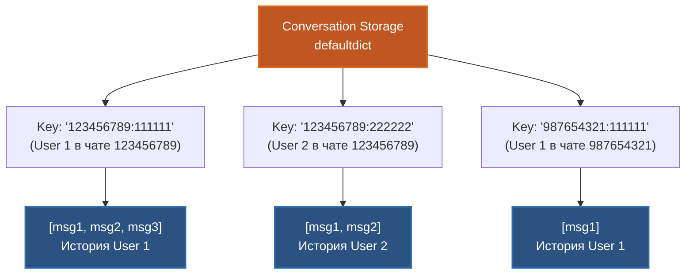
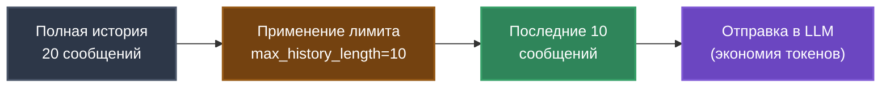

# Data Model

Понимание структур данных и их жизненного цикла в проекте.

## Config - Конфигурация приложения

### Структура

```python
class Config(BaseSettings):
    # Обязательные параметры
    telegram_bot_token: str
    openrouter_api_key: str
    openrouter_model: str
    system_prompt: str
    
    # Опциональные параметры с дефолтами
    max_history_length: int = 10
    temperature: float = 0.7
    max_tokens: int = 1000
    timeout: int = 60
```

### Параметры

| Параметр | Тип | Обязательный | Описание |
|----------|-----|--------------|----------|
| `telegram_bot_token` | str | ✅ | Токен Telegram бота от @BotFather |
| `openrouter_api_key` | str | ✅ | API ключ OpenRouter |
| `openrouter_model` | str | ✅ | Модель LLM (например, `openai/gpt-4o-mini`) |
| `system_prompt` | str | ✅ | Системный промпт, определяющий роль бота |
| `max_history_length` | int | ❌ | Лимит сообщений в истории (default: 10) |
| `temperature` | float | ❌ | Креативность LLM 0.0-2.0 (default: 0.7) |
| `max_tokens` | int | ❌ | Максимум токенов в ответе (default: 1000) |
| `timeout` | int | ❌ | Таймаут API запросов в секундах (default: 60) |

### Особенности

- **Pydantic BaseSettings** - автоматическая валидация типов
- **Загрузка из .env** - через `SettingsConfigDict`
- **Валидация при старте** - падает с ошибкой если обязательные поля отсутствуют
- **Immutable** - конфигурация не меняется после инициализации

### Пример в .env

```env
TELEGRAM_BOT_TOKEN=1234567890:ABCdefGHIjklMNOpqrsTUVwxyz
OPENROUTER_API_KEY=sk-or-v1-abcdef1234567890
OPENROUTER_MODEL=openai/gpt-4o-mini
SYSTEM_PROMPT=Ты - Python Code Reviewer. Анализируешь Python код, находишь баги, предлагаешь улучшения.
MAX_HISTORY_LENGTH=10
TEMPERATURE=0.7
MAX_TOKENS=1000
TIMEOUT=60
```

## Message - Структура сообщения

### Формат

```python
{
    "role": str,         # "user" | "assistant" | "system"
    "content": str,      # Текст сообщения
    "timestamp": float   # Unix timestamp (time.time())
}
```

### Поля

| Поле | Тип | Значения | Описание |
|------|-----|----------|----------|
| `role` | str | `user`, `assistant`, `system` | Роль отправителя |
| `content` | str | любой текст | Содержимое сообщения |
| `timestamp` | float | Unix timestamp | Время создания сообщения |

### Жизненный цикл



### Примеры

**User message:**
```python
{
    "role": "user",
    "content": "def hello():\n  print('hi')",
    "timestamp": 1729098000.123
}
```

**Assistant message:**
```python
{
    "role": "assistant",
    "content": "Найдены замечания:\n1. Отступ должен быть 4 пробела...",
    "timestamp": 1729098003.456
}
```

**System message (промпт):**
```python
{
    "role": "system",
    "content": "Ты - Python Code Reviewer. Анализируешь Python код...",
    "timestamp": 1729098000.000
}
```

## Conversation Storage - Хранилище диалогов

### Структура

```python
from collections import defaultdict

conversations: defaultdict[str, list[dict]] = defaultdict(list)
```

### Ключ пользователя

Формат: `"chat_id:user_id"`

**Примеры**:
- Личный чат: `"123456789:123456789"`
- Групповой чат: `"987654321:123456789"` (разные пользователи имеют разные истории)

### Схема данных



### Пример структуры

```python
{
    "123456789:111111": [
        {"role": "user", "content": "Привет!", "timestamp": 1729098000.0},
        {"role": "assistant", "content": "Здравствуйте!", "timestamp": 1729098001.5},
        {"role": "user", "content": "def test(): pass", "timestamp": 1729098010.0},
        {"role": "assistant", "content": "Код выглядит хорошо", "timestamp": 1729098012.3}
    ],
    "123456789:222222": [
        {"role": "user", "content": "Помоги с кодом", "timestamp": 1729098100.0},
        {"role": "assistant", "content": "Конечно!", "timestamp": 1729098101.2}
    ]
}
```

## Операции с данными

### Добавление сообщения

```python
conversation.add_message(
    chat_id=123456789,
    user_id=111111,
    role="user",
    content="Проверь этот код"
)
```

**Что происходит**:
1. Формируется ключ: `"123456789:111111"`
2. Создается message с timestamp
3. Добавляется в `conversations[key]`
4. `defaultdict` автоматически создает список для новых пользователей

### Получение истории

```python
history = conversation.get_history(
    chat_id=123456789,
    user_id=111111,
    limit=10  # Последние 10 сообщений
)
```

**Что происходит**:
1. Формируется ключ: `"123456789:111111"`
2. Извлекаются последние N сообщений
3. **Фильтруется timestamp** - возвращается только `role` и `content`
4. Формат готов для отправки в LLM API

**Результат**:
```python
[
    {"role": "user", "content": "Привет!"},
    {"role": "assistant", "content": "Здравствуйте!"}
]
```

### Очистка истории

```python
conversation.clear_history(
    chat_id=123456789,
    user_id=111111
)
```

Удаляет все сообщения для пользователя. Используется при команде `/reset`.

### Ограничение истории



## Системный промпт (System Prompt)

### Назначение

Системный промпт определяет **роль и поведение** бота. Это ключевой элемент ролевой модели AI-продукта.

### Текущий промпт

```
Ты - Python Code Reviewer. 
Анализируешь Python код, находишь баги, предлагаешь улучшения. 
Работаешь только с Python, не пишешь код за пользователя.
```

### Использование

Системный промпт передается в LLM API как первое сообщение с `role: "system"`:

```python
messages = [
    {"role": "system", "content": config.system_prompt},
    {"role": "user", "content": "def hello():\n  print('hi')"},
]
```

### Влияние на поведение

| Элемент промпта | Эффект |
|-----------------|--------|
| "Ты - Python Code Reviewer" | Определяет роль и специализацию |
| "Анализируешь Python код" | Описывает основную функцию |
| "Работаешь только с Python" | Устанавливает границы (ограничения) |
| "Не пишешь код за пользователя" | Определяет стиль ответов |

## Особенности модели данных

### In-memory storage

**Преимущества**:
- ✅ Простая реализация
- ✅ Быстрый доступ
- ✅ Не требует БД

**Ограничения**:
- ❌ История теряется при перезапуске
- ❌ Не масштабируется на множество серверов
- ❌ Нет персистентности

**Вывод**: Это нормально для MVP и разработки.

### defaultdict

Использование `defaultdict(list)` упрощает код:

**Без defaultdict** (плохо):
```python
if user_key not in conversations:
    conversations[user_key] = []
conversations[user_key].append(message)
```

**С defaultdict** (хорошо):
```python
conversations[user_key].append(message)
```

### Фильтрация timestamp

Timestamp хранится для отладки, но **не отправляется в LLM**:

- В storage: `{"role": "user", "content": "...", "timestamp": 123.45}`
- В LLM: `{"role": "user", "content": "..."}`

Это экономит токены и упрощает формат для API.

## Что дальше?

- [Architecture Overview](02_ARCHITECTURE_OVERVIEW.md) - общая архитектура
- [🎨 Архитектурная визуализация](../architecture_visualization.md) - диаграммы Data Flow и Storage Structure
- [Integrations](04_INTEGRATIONS.md) - работа с внешними API
- [Configuration](06_CONFIGURATION_AND_SECRETS.md) - настройка конфигурации

