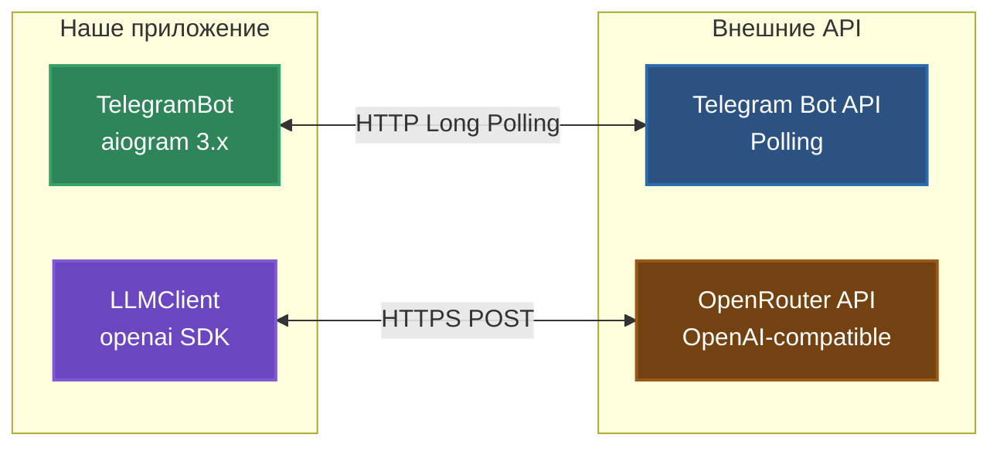
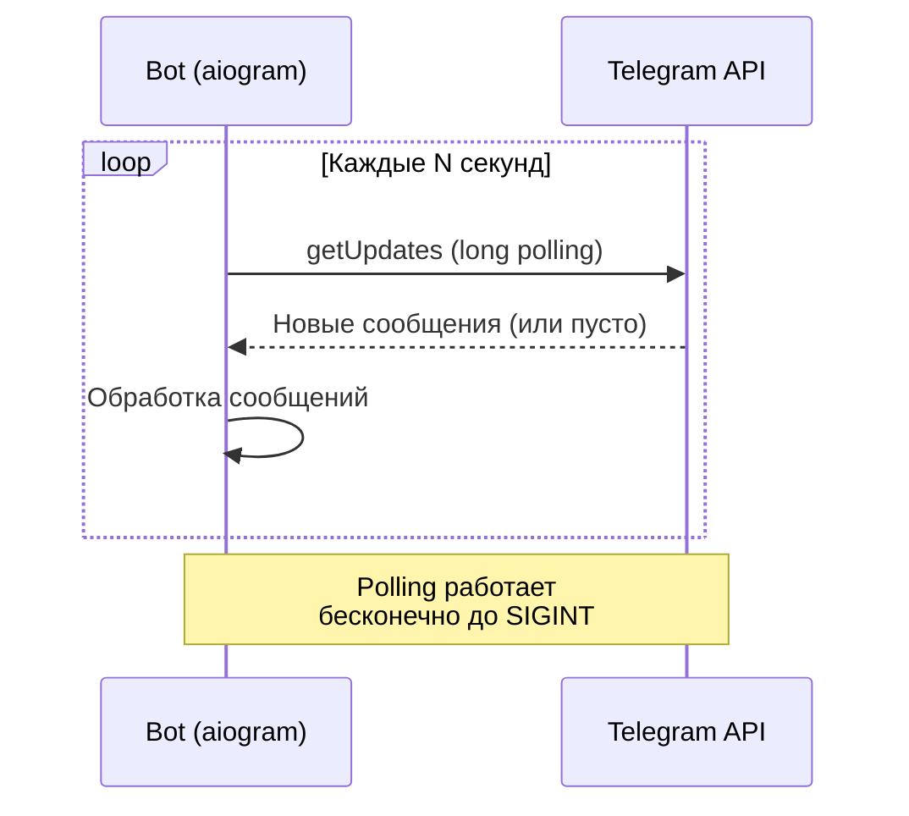
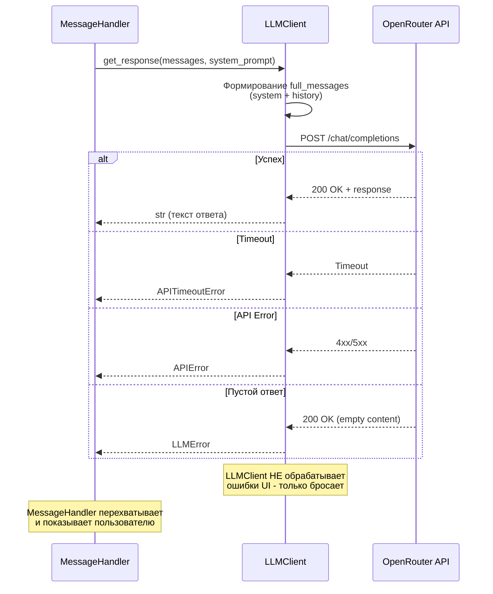

# Integrations

Работа с внешними API: Telegram Bot API и OpenRouter API.

## Обзор интеграций



## Telegram Bot API

### Библиотека: aiogram 3.x

Современный асинхронный фреймворк для работы с Telegram Bot API.

**Почему aiogram**:
- ✅ Полностью асинхронный (async/await)
- ✅ Поддержка Telegram Bot API 7.0+
- ✅ Типизированный (type hints)
- ✅ Активная разработка

### Режим работы: Polling

**Long Polling** - бот регулярно спрашивает Telegram о новых сообщениях.



**Альтернатива**: Webhooks (не используется в проекте).

### Основные компоненты

#### Bot

Главный объект для взаимодействия с Telegram API:

```python
from aiogram import Bot
from aiogram.client.default import DefaultBotProperties
from aiogram.enums import ParseMode

bot = Bot(
    token=config.telegram_bot_token,
    default=DefaultBotProperties(parse_mode=ParseMode.HTML)
)
```

**ParseMode.HTML** - разрешает использовать HTML форматирование в сообщениях.

#### Dispatcher

Маршрутизатор событий (команды, сообщения):

```python
from aiogram import Dispatcher

dp = Dispatcher()
```

#### Регистрация обработчиков

```python
from aiogram.filters import Command

# Команды
dp.message.register(handler.start_command, Command("start"))
dp.message.register(handler.role_command, Command("role"))
dp.message.register(handler.reset_command, Command("reset"))

# Текстовые сообщения (должно быть последним)
dp.message.register(handler.handle_message)
```

**Важно**: Обработчик текстовых сообщений регистрируется **последним**, чтобы не перехватывать команды.

#### Запуск polling

```python
await dp.start_polling(bot)
```

### Обработка сообщений

#### Структура Message

```python
from aiogram import types

async def handle_message(message: types.Message) -> None:
    # Доступ к данным
    user_id = message.from_user.id      # ID пользователя
    chat_id = message.chat.id           # ID чата
    text = message.text                 # Текст сообщения
    
    # Отправка ответа
    await message.answer("Ответ пользователю")
    
    # Typing индикатор
    await message.bot.send_chat_action(chat_id, "typing")
```

#### Поддерживаемые команды

| Команда | Обработчик | Описание |
|---------|-----------|----------|
| `/start` | `start_command()` | Приветствие и описание роли |
| `/role` | `role_command()` | Детальное описание роли бота |
| `/me` | `me_command()` | Просмотр профиля и статистики пользователя |
| `/reset` | `reset_command()` | Очистка истории диалога |
| Текст | `handle_message()` | Обработка текста через LLM |

### HTML форматирование

Бот использует HTML для форматирования ответов:

```python
message_text = (
    "👋 <b>Привет! Я Python Code Reviewer.</b>\n\n"
    "💡 <b>Команды:</b>\n"
    "• /role - подробнее о моей роли\n"
)
```

**Поддерживаемые теги**:
- `<b>текст</b>` - жирный
- `<i>текст</i>` - курсив
- `<code>код</code>` - моноширинный
- `<pre>код</pre>` - блок кода

### Ограничения Telegram API

| Ограничение | Значение |
|-------------|----------|
| Размер сообщения | 4096 символов |
| Частота запросов | ~30 сообщений/сек |
| Размер файла | До 50 МБ (для ботов) |

## OpenRouter API

### Библиотека: openai SDK

Официальный OpenAI SDK, совместимый с OpenRouter.

**Почему OpenRouter**:
- ✅ Доступ к множеству моделей (GPT-4, Claude, Gemini, и др.)
- ✅ Единый API (OpenAI-compatible)
- ✅ Низкие цены / бесплатные модели
- ✅ Автоматический выбор провайдера

### Инициализация клиента

```python
from openai import AsyncOpenAI

client = AsyncOpenAI(
    base_url="https://openrouter.ai/api/v1",
    api_key=config.openrouter_api_key,
)
```

**base_url** - ключевой момент: переключает с OpenAI на OpenRouter.

### Формат запроса

```python
response = await client.chat.completions.create(
    model="openai/gpt-4o-mini",  # Модель OpenRouter
    messages=[
        {"role": "system", "content": "Ты - Python Code Reviewer..."},
        {"role": "user", "content": "def test(): pass"}
    ],
    temperature=0.7,
    max_tokens=1000,
    timeout=60,
)
```

### Параметры запроса

| Параметр | Тип | Описание |
|----------|-----|----------|
| `model` | str | ID модели в формате `provider/model` |
| `messages` | list | История диалога (role + content) |
| `temperature` | float | Креативность 0.0-2.0 (чем выше, тем более вариативные ответы) |
| `max_tokens` | int | Максимум токенов в ответе |
| `timeout` | int | Таймаут запроса в секундах |

### Формат ответа

```python
response.choices[0].message.content  # str - текст ответа
```

**Полная структура**:
```python
{
    "choices": [
        {
            "message": {
                "role": "assistant",
                "content": "Ответ модели..."
            }
        }
    ]
}
```

### Доступные модели

Примеры популярных моделей:

| Модель | Provider | Описание |
|--------|----------|----------|
| `openai/gpt-4o-mini` | OpenAI | Быстрая и дешевая |
| `openai/gpt-4o` | OpenAI | Продвинутая модель |
| `anthropic/claude-3.5-sonnet` | Anthropic | Отлично для кода |
| `google/gemini-2.0-flash-exp:free` | Google | Бесплатная |

Полный список: [openrouter.ai/models](https://openrouter.ai/models)

### Поток запроса к LLM



## Обработка ошибок

### Исключения LLMClient

```python
from openai import APIError, APITimeoutError
from .llm_client import LLMError
```

| Исключение | Когда возникает | Обработка |
|------------|-----------------|-----------|
| `APITimeoutError` | Запрос превысил `timeout` секунд | Сообщение о таймауте |
| `APIError` | Ошибка API (rate limit, invalid key, и др.) | Сообщение об ошибке API |
| `LLMError` | Пустой ответ или неожиданная ошибка | Общее сообщение об ошибке |

### Обработка в MessageHandler

```python
try:
    response = await self.llm_client.get_response(messages, system_prompt)
    await message.answer(response)
    
except APITimeoutError:
    await message.answer("⏱️ Превышено время ожидания ответа. Попробуйте снова.")
    
except APIError as e:
    await message.answer(f"❌ Ошибка API: {str(e)}\nПопробуйте позже или /reset.")
    
except LLMError as e:
    await message.answer(f"❌ Ошибка LLM: {str(e)}\nПопробуйте /reset.")
```

**Принцип**: LLMClient бросает исключения, MessageHandler их ловит и показывает пользователю.

## Rate Limits и ограничения

### Telegram

- **30 сообщений/сек** на бота
- **Один запрос за раз** - aiogram автоматически обрабатывает очередь
- При превышении: `429 Too Many Requests` (встроенный retry в aiogram)

### OpenRouter

Зависит от модели и плана:

| План | Лимит |
|------|-------|
| Free tier | ~10-20 requests/min (зависит от модели) |
| Paid | Выше, зависит от баланса |

При превышении: `429 Too Many Requests` → `APIError` → Сообщение пользователю.

## Мокирование в тестах

### Telegram (aiogram)

```python
from unittest.mock import AsyncMock

# Мокируем Message
mock_message = AsyncMock()
mock_message.from_user.id = 123456
mock_message.chat.id = 123456
mock_message.text = "test"
mock_message.answer = AsyncMock()

# Вызов обработчика
await handler.handle_message(mock_message)

# Проверка
mock_message.answer.assert_called_once()
```

### OpenRouter (LLMClient)

```python
from unittest.mock import AsyncMock, patch

# Мокируем API вызов
with patch.object(llm_client.client.chat.completions, 'create') as mock_create:
    mock_create.return_value = AsyncMock(
        choices=[AsyncMock(message=AsyncMock(content="Mocked response"))]
    )
    
    response = await llm_client.get_response(messages=[...])
    assert response == "Mocked response"
```

### Разделение юнит и интеграционных тестов

- **Юнит-тесты** (`@pytest.mark.unit`) - с моками, не требуют .env
- **Интеграционные** (`@pytest.mark.integration`) - реальные API, требуют .env

```python
@pytest.mark.integration
async def test_llm_real_api():
    """Реальный вызов к OpenRouter API."""
    # Требует OPENROUTER_API_KEY в .env
    pass
```

## Безопасность

### API ключи

- ✅ Хранятся в `.env` (не в коде)
- ✅ `.env` в `.gitignore` (не коммитится)
- ✅ Валидация через Pydantic при старте
- ❌ Не логируем ключи

### HTTPS

Оба API используют HTTPS:
- Telegram: `https://api.telegram.org`
- OpenRouter: `https://openrouter.ai/api/v1`

### Timeout защита

```python
timeout=60  # Не ждем ответ бесконечно
```

Защита от зависших запросов.

## Что дальше?

- [🎨 Архитектурная визуализация](../architecture_visualization.md) - диаграммы Sequence и Error Handling
- [Configuration & Secrets](06_CONFIGURATION_AND_SECRETS.md) - управление ключами
- [Codebase Tour](05_CODEBASE_TOUR.md) - где находится код интеграций
- [CI/CD](07_CI_CD.md) - тестирование интеграций

