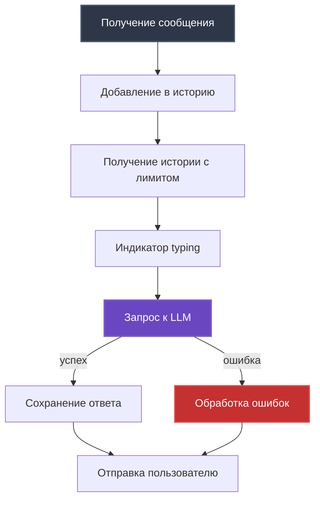
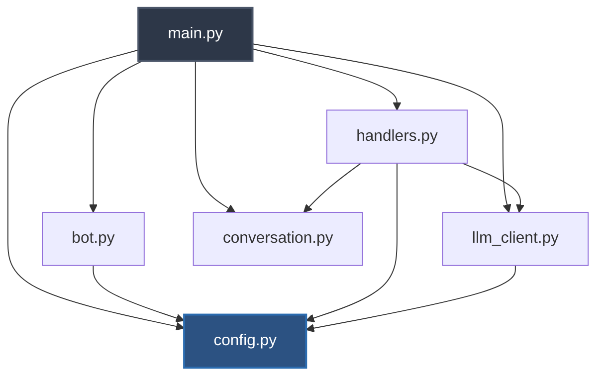

# Codebase Tour

Детальная навигация по структуре проекта и коду. Где что находится и как это работает.

## Структура проекта

```
systech-aidd/
├── .cursor/              # Правила для AI-ассистента
│   └── rules/
│       ├── conventions.mdc         # Соглашения по коду
│       ├── qa_conventions.mdc      # QA соглашения и TDD
│       ├── workflow.mdc            # Базовый workflow
│       ├── workflow_tdd.mdc        # TDD workflow
│       └── workflow_tech_debt.mdc  # Tech debt workflow
├── docs/                 # Документация
│   ├── guides/           # 📚 Гайды (этот документ)
│   ├── idea.md           # Концепция проекта
│   ├── vision.md         # Техническое видение
│   ├── tasklist.md       # Основные задачи
│   └── tasklist_tech_dept.md
├── htmlcov/              # HTML отчет coverage (генерируется)
├── src/                  # 🎯 Исходный код (6 файлов)
│   ├── __init__.py
│   ├── main.py           # Точка входа
│   ├── config.py         # Конфигурация
│   ├── bot.py            # Telegram Bot
│   ├── handlers.py       # Обработчики сообщений
│   ├── llm_client.py     # LLM клиент
│   └── conversation.py   # Хранилище диалогов
├── tests/                # 🧪 Тесты (60 тестов)
│   ├── __init__.py
│   ├── test_bot.py
│   ├── test_config.py
│   ├── test_conversation.py
│   ├── test_handlers.py
│   ├── test_llm_client.py
│   └── test_llm_client_unit.py
├── .env                  # Конфигурация (НЕ в git)
├── .gitignore
├── Makefile              # Команды разработки
├── pyproject.toml        # Конфигурация проекта + зависимости
├── pytest.ini            # Конфигурация pytest
├── README.md
└── uv.lock               # Lockfile зависимостей
```

## src/ - Исходный код

### main.py - Точка входа

**Назначение**: Инициализация и запуск приложения.

**Ключевые функции**:
```python
async def main() -> None:
    """Главная функция приложения."""
    # 1. Загрузка .env
    load_dotenv()
    
    # 2. Создание Config с валидацией
    config = Config()
    
    # 3. Инициализация компонентов
    conversation = Conversation()
    llm_client = LLMClient(config)
    bot = TelegramBot(config)
    message_handler = MessageHandler(config, llm_client, conversation)
    
    # 4. Регистрация обработчиков
    bot.register_handlers(message_handler)
    
    # 5. Запуск polling
    await bot.start()
```

**Запуск**: `python -m src.main` (как модуль!)

**Логирование**:
- Настройка `logging.basicConfig()`
- Уровень INFO
- Формат: `%(asctime)s - %(name)s - %(levelname)s - %(message)s`

**Обработка ошибок**:
- `KeyboardInterrupt` - корректное завершение
- `Exception` - логирование с трейсбеком

---

### config.py - Конфигурация

**Назначение**: Валидация настроек из `.env`.

**Класс Config**:
```python
class Config(BaseSettings):
    # Обязательные
    telegram_bot_token: str
    openrouter_api_key: str
    openrouter_model: str
    system_prompt: str
    
    # Опциональные с дефолтами
    max_history_length: int = 10
    temperature: float = 0.7
    max_tokens: int = 1000
    timeout: int = 60
    
    model_config = SettingsConfigDict(
        env_file=".env",
        env_file_encoding="utf-8"
    )
```

**Технологии**:
- `pydantic-settings` - автоматическая загрузка из `.env`
- Валидация типов при инициализации
- Падает с ошибкой если обязательные поля отсутствуют

**Использование**:
```python
config = Config()  # Автоматически загружает .env
print(config.openrouter_model)  # "openai/gpt-4o-mini"
```

**Строк кода**: ~22

---

### bot.py - Telegram Bot

**Назначение**: Инициализация aiogram и регистрация handlers.

**Класс TelegramBot**:
```python
class TelegramBot:
    def __init__(self, config: Config):
        self.bot = Bot(
            token=config.telegram_bot_token,
            default=DefaultBotProperties(parse_mode=ParseMode.HTML)
        )
        self.dp = Dispatcher()
    
    def register_handlers(self, message_handler: MessageHandler) -> None:
        # Команды
        self.dp.message.register(message_handler.start_command, Command("start"))
        self.dp.message.register(message_handler.role_command, Command("role"))
        self.dp.message.register(message_handler.reset_command, Command("reset"))
        
        # Текстовые сообщения (последним!)
        self.dp.message.register(message_handler.handle_message)
    
    async def start(self) -> None:
        await self.dp.start_polling(self.bot)
```

**Зависимости**: Config

**Особенности**:
- ParseMode.HTML для форматирования
- Порядок регистрации важен (команды → текст)
- `finally: await self.bot.session.close()`

**Строк кода**: ~59

---

### handlers.py - Обработчики сообщений

**Назначение**: Логика обработки команд и сообщений.

**Класс MessageHandler**:
```python
class MessageHandler:
    def __init__(
        self,
        config: Config,
        llm_client: LLMClient,
        conversation: Conversation
    ):
        self.config = config
        self.llm_client = llm_client
        self.conversation = conversation
```

**Методы**:

| Метод | Назначение |
|-------|-----------|
| `start_command()` | Обработка `/start` - приветствие |
| `role_command()` | Обработка `/role` - описание роли |
| `reset_command()` | Обработка `/reset` - очистка истории |
| `handle_message()` | Обработка текста + error handling |

**Поток handle_message()**:


**Обработка ошибок**:
- `APITimeoutError` → "⏱️ Превышено время ожидания"
- `APIError` → "❌ Ошибка API: {детали}"
- `LLMError` → "❌ Ошибка LLM: {детали}"
- `Exception` → "❌ Непредвиденная ошибка"

**Логирование**:
- INFO: команды, получение/отправка сообщений
- ERROR: все исключения с `exc_info=True`

**Строк кода**: ~179

---

### llm_client.py - LLM клиент

**Назначение**: Взаимодействие с OpenRouter API.

**Класс LLMError**:
```python
class LLMError(Exception):
    """Базовое исключение для ошибок LLM."""
    pass
```

**Класс LLMClient**:
```python
class LLMClient:
    def __init__(self, config: Config):
        self.client = AsyncOpenAI(
            base_url="https://openrouter.ai/api/v1",
            api_key=config.openrouter_api_key,
        )
```

**Главный метод**:
```python
async def get_response(
    self,
    messages: list[dict[str, str]],
    system_prompt: str | None = None
) -> str:
    """
    Raises:
        APITimeoutError: таймаут
        APIError: ошибка API
        LLMError: другие ошибки
    """
    # Формирование запроса
    full_messages = []
    if system_prompt:
        full_messages.append({"role": "system", "content": system_prompt})
    full_messages.extend(messages)
    
    # API вызов
    response = await self.client.chat.completions.create(
        model=self.config.openrouter_model,
        messages=full_messages,
        temperature=self.config.temperature,
        max_tokens=self.config.max_tokens,
        timeout=self.config.timeout,
    )
    
    # Извлечение ответа
    answer = response.choices[0].message.content
    if not answer:
        raise LLMError("Empty response from LLM")
    
    return answer
```

**Дополнительно**:
- `test_connection()` - проверка подключения (для интеграционных тестов)

**Принцип**: Бросает исключения, **не обрабатывает UI**.

**Строк кода**: ~110

---

### conversation.py - Хранилище диалогов

**Назначение**: Управление историей сообщений (in-memory).

**Класс Conversation**:
```python
class Conversation:
    def __init__(self) -> None:
        self.conversations: dict[str, list[dict[str, Any]]] = defaultdict(list)
```

**Методы**:

```python
def add_message(
    self,
    chat_id: int,
    user_id: int,
    role: str,
    content: str
) -> None:
    """Добавление сообщения в историю."""
    user_key = f"{chat_id}:{user_id}"
    message = {
        "role": role,
        "content": content,
        "timestamp": time.time(),
    }
    self.conversations[user_key].append(message)

def get_history(
    self,
    chat_id: int,
    user_id: int,
    limit: int | None = None
) -> list[dict[str, str]]:
    """Получение истории (без timestamp)."""
    user_key = f"{chat_id}:{user_id}"
    messages = self.conversations[user_key]
    
    if limit:
        messages = messages[-limit:]
    
    # Фильтруем timestamp
    return [
        {"role": msg["role"], "content": msg["content"]}
        for msg in messages
    ]

def clear_history(self, chat_id: int, user_id: int) -> None:
    """Очистка истории."""
    user_key = f"{chat_id}:{user_id}"
    self.conversations[user_key] = []

def get_stats(self) -> dict[str, int]:
    """Статистика (для отладки)."""
    return {
        "total_users": len(self.conversations),
        "total_messages": sum(len(msgs) for msgs in self.conversations.values()),
    }
```

**Особенности**:
- `defaultdict(list)` - автоматическое создание списков
- Ключ: `"chat_id:user_id"` - разделение пользователей
- Timestamp хранится, но не отправляется в LLM

**Строк кода**: ~111

---

## tests/ - Тесты

### Организация тестов

**Принцип**: 1 файл тестов = 1 модуль кода

| Тестовый файл | Тестирует | Тип |
|---------------|-----------|-----|
| `test_config.py` | `config.py` | Юнит |
| `test_conversation.py` | `conversation.py` | Юнит |
| `test_bot.py` | `bot.py` | Юнит |
| `test_handlers.py` | `handlers.py` | Юнит |
| `test_llm_client_unit.py` | `llm_client.py` | Юнит (моки) |
| `test_llm_client.py` | `llm_client.py` | Интеграционный |

**Всего**: 60 тестов (47 юнит + 13 интеграционных)

### Маркеры pytest

```python
@pytest.mark.asyncio      # Async тест
@pytest.mark.integration  # Интеграционный тест (требует .env)
```

**Запуск**:
- Юнит: `make test-unit` (без .env)
- Интеграционные: `make test-integration` (с .env)
- Все: `make test`

### Примеры тестов

**Юнит-тест с моками**:
```python
@pytest.mark.asyncio
async def test_handle_message_success():
    # Arrange
    mock_llm = AsyncMock()
    mock_llm.get_response.return_value = "Mocked response"
    
    handler = MessageHandler(config, mock_llm, conversation)
    mock_message = create_mock_message(text="test")
    
    # Act
    await handler.handle_message(mock_message)
    
    # Assert
    mock_message.answer.assert_called_once_with("Mocked response")
```

**Интеграционный тест**:
```python
@pytest.mark.integration
async def test_llm_real_api(llm_client):
    """Реальный вызов к OpenRouter API."""
    messages = [{"role": "user", "content": "Say 'ok'"}]
    response = await llm_client.get_response(messages)
    assert isinstance(response, str)
    assert len(response) > 0
```

---

## Конфигурационные файлы

### Makefile

**Назначение**: Автоматизация команд разработки.

**Команды**:
```makefile
install           # uv sync
run               # uv run python -m src.main
lint              # ruff check + mypy
format            # ruff format
test              # pytest с coverage
test-unit         # только юнит-тесты
test-integration  # только интеграционные
ci                # lint + test-unit (для CI/CD)
```

---

### pyproject.toml

**Назначение**: Конфигурация проекта, зависимости, инструментов.

**Секции**:

```toml
[project]
name = "systech-aidd"
requires-python = ">=3.11"
dependencies = [
    "aiogram>=3.0.0",
    "openai>=1.0.0",
    "pydantic>=2.0.0",
    # ...
]

[tool.ruff]
line-length = 100
target-version = "py311"

[tool.ruff.lint]
select = ["E", "F", "I", "N", "W", "B", "C4", "UP", "SIM", "RET", "ARG"]

[tool.mypy]
python_version = "3.11"
strict = true
```

**Что настроено**:
- Зависимости проекта
- Ruff: правила линтинга, длина строки
- Mypy: strict mode, типизация

---

### pytest.ini

**Назначение**: Конфигурация pytest.

```ini
[pytest]
markers =
    asyncio: marks tests as async tests
    slow: marks tests as slow
    integration: marks tests as integration tests

filterwarnings =
    ignore::DeprecationWarning

addopts = 
    -v
    --tb=short
    --strict-markers
```

---

## .cursor/rules/ - Правила для AI

**Назначение**: Правила и соглашения для работы с AI-ассистентом (Cursor).

| Файл | Содержание |
|------|-----------|
| `conventions.mdc` | Соглашения по коду (KISS, ООП, структура) |
| `qa_conventions.mdc` | QA соглашения и TDD принципы |
| `workflow.mdc` | Базовый workflow разработки |
| `workflow_tdd.mdc` | TDD workflow (Red-Green-Refactor) |
| `workflow_tech_debt.mdc` | Процесс работы с техническим долгом |

**Применение**: AI-ассистент следует этим правилам при генерации кода.

---

## Навигация по коду

### Где искать что?

| Нужно найти | Файл | Строки |
|-------------|------|--------|
| Точка входа | `src/main.py` | `main()` |
| Инициализация компонентов | `src/main.py` | 36-40 |
| Настройки из .env | `src/config.py` | весь файл |
| Регистрация команд | `src/bot.py` | `register_handlers()` |
| Обработка `/start` | `src/handlers.py` | `start_command()` |
| Обработка текста | `src/handlers.py` | `handle_message()` |
| Запрос к LLM | `src/llm_client.py` | `get_response()` |
| История диалогов | `src/conversation.py` | весь файл |
| Обработка ошибок LLM | `src/handlers.py` | try-except в `handle_message()` |

### Зависимости между модулями



### Относительные импорты

Все модули в `src/` используют относительные импорты:

```python
# В src/main.py
from .config import Config
from .bot import TelegramBot
from .handlers import MessageHandler
# ...

# В src/handlers.py
from .config import Config
from .conversation import Conversation
from .llm_client import LLMClient, LLMError
```

**Важно**: Запуск как модуль `python -m src.main`, не `python src/main.py`.

---

## Метрики проекта

| Метрика | Значение |
|---------|----------|
| Всего файлов кода | 6 |
| Всего тестов | 60 (47 юнит + 13 интеграционных) |
| Coverage | 81% |
| Строк кода (src/) | ~491 |
| Строк тестов (tests/) | ~1200+ |
| Ruff ошибок | 0 |
| Mypy статус | Success (strict) |

---

## Что дальше?

- [Development Workflow](08_DEVELOPMENT_WORKFLOW.md) - как разрабатывать
- [Architecture Overview](02_ARCHITECTURE_OVERVIEW.md) - общая архитектура
- [CI/CD](07_CI_CD.md) - автоматизация проверок

