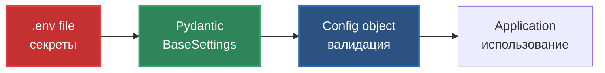
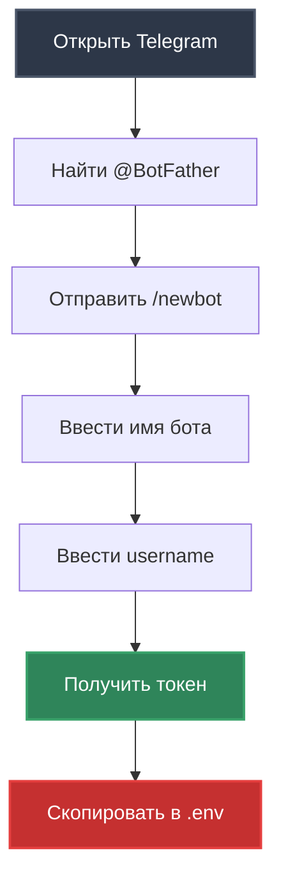
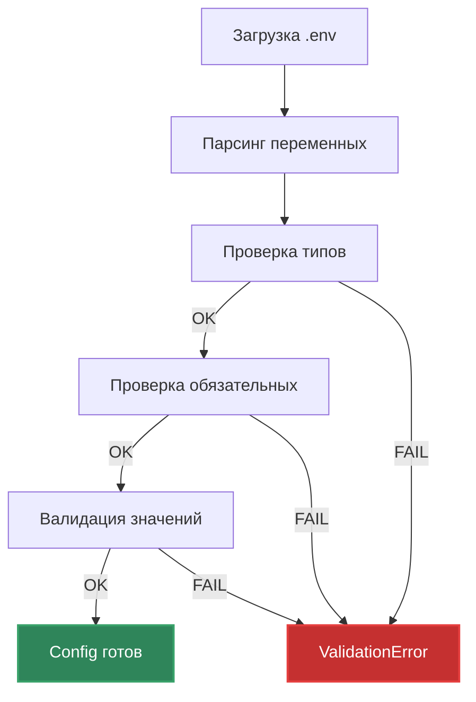

# Configuration and Secrets

Управление конфигурацией и секретными данными.

## Обзор конфигурации



## Файл .env

### Структура

Создайте файл `.env` в корне проекта:

```env
# ==========================================
# Telegram Bot Configuration
# ==========================================
TELEGRAM_BOT_TOKEN=your_bot_token_here

# ==========================================
# OpenRouter API Configuration
# ==========================================
OPENROUTER_API_KEY=your_openrouter_key_here
OPENROUTER_MODEL=openai/gpt-4o-mini

# ==========================================
# LLM Parameters
# ==========================================
TEMPERATURE=0.7
MAX_TOKENS=1000
TIMEOUT=60

# ==========================================
# Bot Settings (Role Configuration)
# ==========================================
SYSTEM_PROMPT=Ты - Python Code Reviewer. Анализируешь Python код, находишь баги, предлагаешь улучшения. Работаешь только с Python, не пишешь код за пользователя.
MAX_HISTORY_LENGTH=10
```

### Параметры

| Параметр | Обязательный | Тип | Описание | Пример |
|----------|--------------|-----|----------|--------|
| `TELEGRAM_BOT_TOKEN` | ✅ | str | Токен от @BotFather | `1234567890:ABCdef...` |
| `OPENROUTER_API_KEY` | ✅ | str | API ключ OpenRouter | `sk-or-v1-abc123...` |
| `OPENROUTER_MODEL` | ✅ | str | ID модели LLM | `openai/gpt-4o-mini` |
| `SYSTEM_PROMPT` | ✅ | str | Системный промпт (роль бота) | См. ниже |
| `MAX_HISTORY_LENGTH` | ❌ | int | Лимит сообщений в истории | `10` (default) |
| `TEMPERATURE` | ❌ | float | Креативность LLM (0.0-2.0) | `0.7` (default) |
| `MAX_TOKENS` | ❌ | int | Максимум токенов в ответе | `1000` (default) |
| `TIMEOUT` | ❌ | int | Таймаут API запросов (сек) | `60` (default) |

## Получение API ключей

### Telegram Bot Token



**Шаги**:

1. Откройте Telegram
2. Найдите [@BotFather](https://t.me/BotFather)
3. Отправьте `/newbot`
4. Введите **имя** бота (например: "My Code Reviewer")
5. Введите **username** бота (должен заканчиваться на `bot`, например: `my_code_reviewer_bot`)
6. Скопируйте полученный токен
7. Вставьте в `.env`: `TELEGRAM_BOT_TOKEN=полученный_токен`

**Формат токена**: `1234567890:ABCdefGHIjklMNOpqrsTUVwxyz`

**Безопасность**:
- ⚠️ Никогда не публикуйте токен в git
- ⚠️ Не показывайте токен в логах
- ✅ Храните только в `.env`

### OpenRouter API Key

**Шаги**:

1. Перейдите на [openrouter.ai](https://openrouter.ai/)
2. Нажмите **Sign In** (можно через Google/GitHub)
3. Перейдите в [Keys](https://openrouter.ai/keys)
4. Нажмите **Create Key**
5. Укажите имя (например: "systech-aidd")
6. Скопируйте ключ
7. Вставьте в `.env`: `OPENROUTER_API_KEY=полученный_ключ`

**Формат ключа**: `sk-or-v1-abcdef1234567890...`

**Пополнение баланса**:
- OpenRouter требует баланс для платных моделей
- Есть бесплатные модели (например, `openai/gpt-4o-mini`)
- Credits → Add Credits

### Выбор модели

Популярные модели:

| Модель | Provider | Скорость | Качество | Цена |
|--------|----------|----------|----------|------|
| `openai/gpt-4o-mini` | OpenAI | ⚡⚡⚡ | ⭐⭐⭐ | 💰 |
| `openai/gpt-4o` | OpenAI | ⚡⚡ | ⭐⭐⭐⭐⭐ | 💰💰💰 |
| `anthropic/claude-3.5-sonnet` | Anthropic | ⚡⚡ | ⭐⭐⭐⭐⭐ | 💰💰💰 |
| `google/gemini-2.0-flash-exp:free` | Google | ⚡⚡⚡ | ⭐⭐⭐ | 🆓 |

Полный список: [openrouter.ai/models](https://openrouter.ai/models)

## Системный промпт (SYSTEM_PROMPT)

### Назначение

Системный промпт определяет **роль, специализацию и поведение** бота.

### Текущая роль: Python Code Reviewer

```env
SYSTEM_PROMPT=Ты - Python Code Reviewer. Анализируешь Python код, находишь баги, предлагаешь улучшения. Работаешь только с Python, не пишешь код за пользователя.
```

### Структура промпта

Рекомендуемая структура для ролевого AI:

```
Ты - [Название роли].

РОЛЬ:
[Детальное описание роли и специализации]

ФУНКЦИИ:
- [Функция 1]
- [Функция 2]

СТИЛЬ ОБЩЕНИЯ:
[Как общаться с пользователем]

ОГРАНИЧЕНИЯ:
- [Что НЕ входит в роль]
```

### Примеры других ролей

**SQL Query Expert**:
```env
SYSTEM_PROMPT=Ты - SQL Query Expert. Оптимизируешь SQL запросы, объясняешь планы выполнения. Работаешь со всеми диалектами SQL, но не пишешь код приложений.
```

**DevOps Troubleshooter**:
```env
SYSTEM_PROMPT=Ты - DevOps Troubleshooter. Диагностируешь проблемы инфраструктуры, анализируешь логи. Работаешь с Docker, K8s, CI/CD, но не разрабатываешь приложения.
```

### Влияние на команду /role

Системный промпт связан с тем, что показывает команда `/role`. При изменении промпта обновите также текст в `handlers.py`:

```python
async def role_command(self, message: types.Message) -> None:
    role_text = (
        "🎭 <b>Моя роль:</b> Python Code Reviewer\n\n"
        # ... остальное описание должно соответствовать промпту
    )
```

## Pydantic валидация

### Config класс

```python
from pydantic_settings import BaseSettings, SettingsConfigDict

class Config(BaseSettings):
    telegram_bot_token: str
    openrouter_api_key: str
    openrouter_model: str
    system_prompt: str
    
    max_history_length: int = 10
    temperature: float = 0.7
    max_tokens: int = 1000
    timeout: int = 60
    
    model_config = SettingsConfigDict(
        env_file=".env",
        env_file_encoding="utf-8"
    )
```

### Что проверяется



**Типы валидации**:

1. **Обязательные поля**: Падает если отсутствует `TELEGRAM_BOT_TOKEN`
2. **Типы данных**: `MAX_TOKENS` должен быть `int`, не `str`
3. **Значения**: Pydantic автоматически конвертирует типы где возможно

### Пример ошибок

**Отсутствует обязательное поле**:
```
pydantic_core._pydantic_core.ValidationError: 1 validation error for Config
telegram_bot_token
  Field required [type=missing, input_value={...}, input_type=dict]
```

**Неверный тип**:
```
pydantic_core._pydantic_core.ValidationError: 1 validation error for Config
temperature
  Input should be a valid number [type=float_type, input_value='abc', input_type=str]
```

## Безопасность

### Что НЕ коммитить в git

```gitignore
# .gitignore
.env          # ✅ Обязательно!
.env.local
.env.*.local
*.key
*.secret
```

### Что МОЖНО коммитить

```env
# .env.example (шаблон для других разработчиков)
TELEGRAM_BOT_TOKEN=
OPENROUTER_API_KEY=
OPENROUTER_MODEL=openai/gpt-4o-mini
TEMPERATURE=0.7
MAX_TOKENS=1000
TIMEOUT=60
SYSTEM_PROMPT=Ты - [Роль бота]. [Описание].
MAX_HISTORY_LENGTH=10
```

### Проверка перед коммитом

```bash
# Убедитесь что .env в .gitignore
git status

# .env НЕ должен быть в списке
# Если есть - удалите из индекса:
git rm --cached .env
```

### Логирование

**НЕ логируем**:
- ❌ `TELEGRAM_BOT_TOKEN`
- ❌ `OPENROUTER_API_KEY`
- ❌ Полные тексты сообщений пользователей

**Логируем**:
- ✅ Факт загрузки конфигурации
- ✅ Модель LLM
- ✅ Длину сообщений (не содержимое)

```python
# Хорошо
logger.info(f"LLM client initialized with model: {config.openrouter_model}")

# Плохо
logger.info(f"API key: {config.openrouter_api_key}")  # ❌
```

## Разные окружения

### Development (.env)

```env
OPENROUTER_MODEL=openai/gpt-4o-mini
TEMPERATURE=0.7
TIMEOUT=60
```

### Production (.env.prod)

```env
OPENROUTER_MODEL=anthropic/claude-3.5-sonnet
TEMPERATURE=0.5
TIMEOUT=120
```

**Использование**:
```bash
# Development (default)
make run

# Production
cp .env.prod .env
make run
```

## Отладка проблем

### Проблема: "Failed to load configuration"

**Причина**: Отсутствует `.env` или обязательные поля не заполнены.

**Решение**:
1. Проверьте наличие `.env` в корне проекта
2. Убедитесь что все обязательные поля заполнены
3. Проверьте формат (нет лишних пробелов, кавычек)

### Проблема: ValidationError

**Причина**: Неверный тип данных.

**Решение**:
```env
# Плохо
MAX_TOKENS="1000"  # ❌ Строка с кавычками

# Хорошо
MAX_TOKENS=1000    # ✅ Число без кавычек
```

### Проблема: Бот не отвечает

**Причина**: Неверный `TELEGRAM_BOT_TOKEN`.

**Решение**:
1. Проверьте токен в [@BotFather](https://t.me/BotFather)
2. Отправьте `/mybots` → выберите бота → API Token
3. Скопируйте заново в `.env`

### Проблема: LLM API error

**Причина**: Неверный `OPENROUTER_API_KEY` или недостаточно баланса.

**Решение**:
1. Проверьте ключ на [openrouter.ai/keys](https://openrouter.ai/keys)
2. Проверьте баланс
3. Попробуйте бесплатную модель: `google/gemini-2.0-flash-exp:free`

## Параметры LLM

### TEMPERATURE (0.0 - 2.0)

**Влияние на ответы**:

| Значение | Поведение | Использование |
|----------|-----------|---------------|
| `0.0` | Детерминированный, одинаковые ответы | Фактические вопросы |
| `0.5` | Сбалансированный | Code review |
| `0.7` | **Рекомендуемый** | Общение |
| `1.0` | Креативный | Генерация идей |
| `2.0` | Очень креативный (хаотичный) | Эксперименты |

### MAX_TOKENS

**Влияние**:
- Ограничивает длину ответа
- 1 токен ≈ 0.75 слова (для английского)
- 1 токен ≈ 0.5 слова (для русского)

**Рекомендации**:
- Code review: `1000-2000`
- Краткие ответы: `500`
- Детальные объяснения: `2000-4000`

### TIMEOUT

**Влияние**:
- Максимальное время ожидания ответа от API
- При превышении: `APITimeoutError`

**Рекомендации**:
- Development: `60` сек
- Production: `120` сек (для сложных запросов)

## Что дальше?

- [Getting Started](01_GETTING_STARTED.md) - быстрая настройка
- [Integrations](04_INTEGRATIONS.md) - как работают API
- [CI/CD](07_CI_CD.md) - автоматизация проверок

