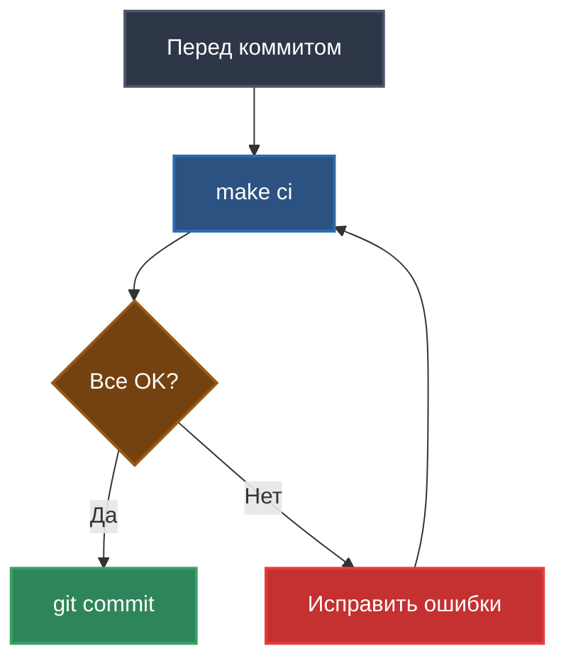

# CI/CD

Автоматизация проверок качества кода и процесс непрерывной интеграции.

## Обзор CI/CD процесса


## Makefile - Команды автоматизации

### Основные команды

```makefile
install           # Установка зависимостей
run               # Запуск бота
format            # Форматирование кода
lint              # Линтинг и типизация
test              # Все тесты + coverage
test-unit         # Только юнит-тесты
test-integration  # Только интеграционные
ci                # CI проверка (lint + test-unit)
```

### Полный Makefile

```makefile
.PHONY: install run lint format test test-unit test-integration ci

install:
	uv sync

run:
	uv run python -m src.main

lint:
	uv run ruff check src/ tests/
	uv run mypy src/

format:
	uv run ruff format src/ tests/

test:
	uv run pytest -v --cov=src --cov-report=term-missing --cov-report=html

test-unit:
	uv run pytest -m "not integration" -v --cov=src --cov-report=term-missing

test-integration:
	uv run pytest -m integration -v

ci: lint test-unit
```

## Инструменты качества кода

### 1. Ruff - Линтер и форматтер

**Что это**: Быстрый линтер на Rust, замена flake8/black/isort.

#### Конфигурация (pyproject.toml)

```toml
[tool.ruff]
line-length = 100
target-version = "py311"

[tool.ruff.lint]
select = ["E", "F", "I", "N", "W", "B", "C4", "UP", "SIM", "RET", "ARG"]
ignore = []

[tool.ruff.lint.per-file-ignores]
"tests/*" = ["ARG"]  # Игнорируем неиспользуемые аргументы в тестах
```

#### Правила линтинга

| Код | Категория | Примеры |
|-----|-----------|---------|
| `E` | pycodestyle errors | Отступы, длина строки |
| `F` | Pyflakes | Неиспользуемые импорты, переменные |
| `I` | isort | Сортировка импортов |
| `N` | pep8-naming | Именование переменных/классов |
| `W` | pycodestyle warnings | Лишние пробелы |
| `B` | flake8-bugbear | Потенциальные баги |
| `C4` | flake8-comprehensions | Оптимизация comprehensions |
| `UP` | pyupgrade | Современный синтаксис Python 3.11+ |
| `SIM` | flake8-simplify | Упрощение кода |
| `RET` | flake8-return | Правильные return |
| `ARG` | flake8-unused-arguments | Неиспользуемые аргументы |

#### Команды

```bash
# Проверка
make lint
# или
uv run ruff check src/ tests/

# Автоматическое исправление
uv run ruff check src/ tests/ --fix

# Форматирование
make format
# или
uv run ruff format src/ tests/
```

#### Примеры проблем

**До Ruff**:
```python
from typing import Dict, List  # UP: используйте dict, list
import os
import sys  # I: неправильный порядок
from .config import Config

def MyFunction(x,y):  # N: PascalCase для функций
    unused_var = 10  # F: неиспользуемая переменная
    return x+y  # E: пробелы вокруг операторов
```

**После Ruff**:
```python
from .config import Config

def my_function(x: int, y: int) -> int:
    return x + y
```

---

### 2. Mypy - Статическая проверка типов

**Что это**: Проверка типов в режиме strict mode.

#### Конфигурация (pyproject.toml)

```toml
[tool.mypy]
python_version = "3.11"
strict = true
warn_return_any = true
disallow_untyped_defs = true
plugins = ["pydantic.mypy"]

[[tool.mypy.overrides]]
module = ["aiogram.*", "openai.*"]
ignore_missing_imports = true
```

#### Что проверяет

- ✅ Все функции типизированы
- ✅ Нет `Any` без необходимости
- ✅ Все return типизированы
- ✅ Pydantic модели валидируются

#### Команды

```bash
# Проверка
uv run mypy src/

# Вывод с деталями
uv run mypy src/ --show-error-codes
```

#### Примеры проблем

**Ошибка: Function is missing a type annotation**
```python
# Плохо
def get_user(id):
    return {"id": id}

# Хорошо
def get_user(id: int) -> dict[str, int]:
    return {"id": id}
```

**Ошибка: Missing return statement**
```python
# Плохо
def process(x: int) -> str:
    if x > 0:
        return "positive"
    # Отсутствует return для x <= 0

# Хорошо
def process(x: int) -> str:
    if x > 0:
        return "positive"
    return "non-positive"
```

---

### 3. Pytest - Тестирование

**Что это**: Фреймворк для тестирования с поддержкой async.

#### Конфигурация (pytest.ini)

```ini
[pytest]
markers =
    asyncio: marks tests as async tests
    slow: marks tests as slow
    integration: marks tests as integration tests

filterwarnings =
    ignore::DeprecationWarning

addopts = 
    -v
    --tb=short
    --strict-markers
```

#### Команды

```bash
# Все тесты с coverage
make test
# или
uv run pytest -v --cov=src --cov-report=term-missing --cov-report=html

# Только юнит-тесты (не требуют .env)
make test-unit
# или
uv run pytest -m "not integration" -v --cov=src --cov-report=term-missing

# Только интеграционные (требуют .env)
make test-integration
# или
uv run pytest -m integration -v

# Конкретный тест
uv run pytest tests/test_config.py -v

# С выводом print
uv run pytest tests/test_config.py -v -s
```

#### Маркеры

```python
@pytest.mark.asyncio        # Async тест
@pytest.mark.integration    # Интеграционный тест
@pytest.mark.slow           # Медленный тест
```

**Пример**:
```python
@pytest.mark.asyncio
async def test_handle_message():
    """Юнит-тест (быстрый, с моками)."""
    pass

@pytest.mark.asyncio
@pytest.mark.integration
async def test_llm_real_api():
    """Интеграционный тест (медленный, требует API ключи)."""
    pass
```

---

### 4. Pytest-cov - Coverage

**Что это**: Измерение покрытия кода тестами.

#### Команды

```bash
# Coverage с отчетом в терминале
uv run pytest --cov=src --cov-report=term-missing

# Coverage + HTML отчет
uv run pytest --cov=src --cov-report=html

# Открыть HTML отчет
# Windows:
start htmlcov/index.html
# Linux/Mac:
open htmlcov/index.html
```

#### Отчет в терминале

```
---------- coverage: platform win32, python 3.11.7 -----------
Name                    Stmts   Miss  Cover   Missing
-----------------------------------------------------
src/__init__.py             0      0   100%
src/bot.py                 35      0   100%
src/config.py              12      0   100%
src/conversation.py        46      0   100%
src/handlers.py            87      0   100%
src/llm_client.py          52     10    81%   96-105
src/main.py                28     28     0%   1-57
-----------------------------------------------------
TOTAL                     260     38    81%
```

#### Метрики проекта

| Модуль | Coverage | Статус |
|--------|----------|--------|
| `config.py` | 100% | ✅ |
| `conversation.py` | 100% | ✅ |
| `handlers.py` | 100% | ✅ |
| `bot.py` | 100% | ✅ |
| `llm_client.py` | 81% | ✅ |
| `main.py` | 0% | ⚠️ (точка входа) |
| **Всего** | **81%** | ✅ |

**Цель**: >80% (достигнута!)

---

## make ci - Комплексная проверка

### Что делает

```bash
make ci
```

Выполняет:
1. `ruff check src/ tests/` - линтинг
2. `mypy src/` - проверка типов
3. `pytest -m "not integration"` - юнит-тесты + coverage

### Когда запускать



**Всегда запускайте перед коммитом!**

### Пример успешного запуска

```bash
$ make ci
uv run ruff check src/ tests/
All checks passed!
uv run mypy src/
Success: no issues found in 6 source files
uv run pytest -m "not integration" -v --cov=src --cov-report=term-missing
======================== test session starts ========================
collected 60 items / 13 deselected / 47 selected

tests/test_bot.py::test_bot_initialization PASSED                [  2%]
tests/test_config.py::test_config_valid PASSED                   [  4%]
...
tests/test_handlers.py::test_handle_message_success PASSED       [100%]

---------- coverage: platform win32, python 3.11.7 -----------
Name                    Stmts   Miss  Cover   Missing
-----------------------------------------------------
src/__init__.py             0      0   100%
src/bot.py                 35      0   100%
src/config.py              12      0   100%
src/conversation.py        46      0   100%
src/handlers.py            87      0   100%
src/llm_client.py          52     10    81%   96-105
src/main.py                28     28     0%   1-57
-----------------------------------------------------
TOTAL                     260     38    81%

======================== 47 passed in 3.21s ========================
```

✅ **Готово к коммиту!**

---

## Workflow разработки

### Полный цикл

```bash
# 1. Создать ветку
git checkout -b feature/my-feature

# 2. Написать код
# ... редактирование файлов ...

# 3. Форматирование
make format

# 4. Линтинг
make lint

# 5. Тесты
make test

# 6. CI проверка
make ci

# 7. Коммит (если все OK)
git add .
git commit -m "feat: add my feature"

# 8. Push
git push origin feature/my-feature
```

### Быстрый цикл (без форматирования)

```bash
# Написать код
# ...

# Проверка
make ci

# Если OK → коммит
git commit -am "fix: update logic"
```

---

## Интеграция с Git

### Pre-commit хук (опционально)

Создайте `.git/hooks/pre-commit`:

```bash
#!/bin/sh
echo "Running CI checks before commit..."

make ci

if [ $? -ne 0 ]; then
    echo "❌ CI checks failed. Commit aborted."
    exit 1
fi

echo "✅ CI checks passed. Proceeding with commit."
exit 0
```

Сделайте исполняемым:
```bash
chmod +x .git/hooks/pre-commit
```

Теперь `git commit` автоматически запустит `make ci`.

---

## Текущие метрики качества

### Статус проекта

| Метрика | Значение | Цель | Статус |
|---------|----------|------|--------|
| **Ruff errors** | 0 | 0 | ✅ |
| **Mypy status** | Success | Success | ✅ |
| **Tests** | 60 | 45+ | ✅ |
| **Coverage** | 81% | 80%+ | ✅ |
| **Типизация** | 100% | 100% | ✅ |

### Достижения

- ✅ 0 ошибок линтера (All checks passed)
- ✅ Mypy strict mode без ошибок
- ✅ 60 тестов (47 юнит + 13 интеграционных)
- ✅ 81% покрытие кода
- ✅ 100% модулей типизированы

---

## Решение проблем

### Ruff ошибки

**Проблема**: Длинные строки (E501)
```python
# Плохо (>100 символов)
response_text = "Very long string that exceeds the maximum line length of 100 characters configured in pyproject.toml"

# Хорошо
response_text = (
    "Very long string that exceeds the maximum line length "
    "of 100 characters configured in pyproject.toml"
)
```

**Проблема**: Неиспользуемые импорты (F401)
```python
# Плохо
from typing import Dict  # F401: unused import

def test():
    pass

# Хорошо: удалить импорт
def test():
    pass
```

### Mypy ошибки

**Проблема**: Incompatible types
```python
# Плохо
def get_name() -> str:
    return None  # error: Incompatible return value type

# Хорошо
def get_name() -> str | None:
    return None
```

### Тесты не проходят

**Проблема**: Интеграционные тесты падают без .env

**Решение**: Запускайте юнит-тесты
```bash
make test-unit  # Не требует .env
```

**Проблема**: Coverage ниже 80%

**Решение**: Добавьте тесты для непокрытых строк
```bash
# Посмотрите какие строки не покрыты
uv run pytest --cov=src --cov-report=term-missing
```

---

## Что дальше?

- [Development Workflow](08_DEVELOPMENT_WORKFLOW.md) - процесс разработки
- [Codebase Tour](05_CODEBASE_TOUR.md) - структура кода
- [Getting Started](01_GETTING_STARTED.md) - быстрый старт

