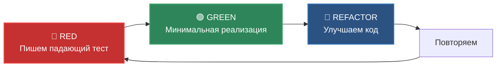
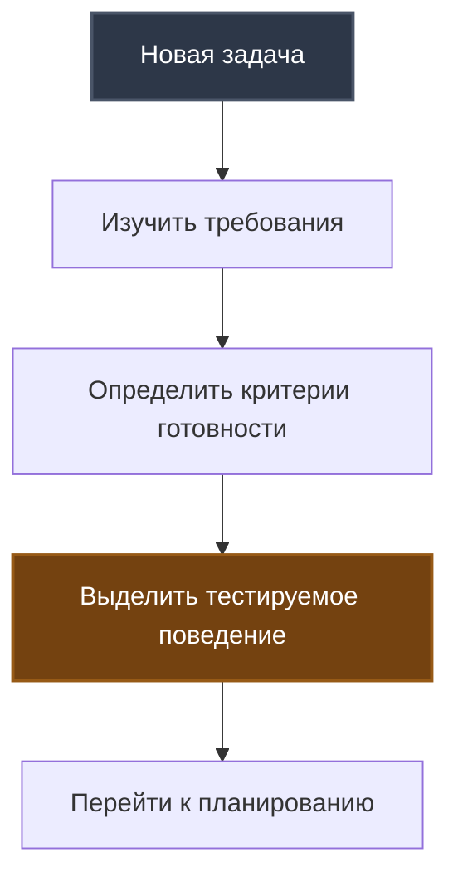
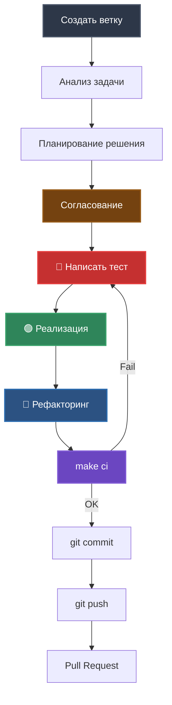

# Development Workflow

Процесс разработки, тестирования и code review с применением TDD.

## Принципы разработки

### TDD (Test-Driven Development)



**Преимущества TDD**:
- ✅ Тестируемый дизайн кода
- ✅ Документация через тесты
- ✅ Уверенность в рефакторинге
- ✅ Меньше багов

### KISS (Keep It Simple, Stupid)

- Простота > сложность
- Прямолинейный код > абстракции
- Читаемость > краткость

### SRP (Single Responsibility Principle)

- 1 класс = 1 ответственность
- 1 функция = 1 задача
- Разделение UI и бизнес-логики

## Этапы разработки

### 1. Анализ задачи



**Действия**:
1. Прочитать задачу из `docs/tasklist.md` или issue
2. Определить критерий готовности (DoD - Definition of Done)
3. **Выделить тестируемое поведение** - ключевое для TDD

**Пример**:
```
Задача: Добавить команду /stats для отображения статистики

Критерий готовности:
- Команда /stats работает
- Показывает количество пользователей и сообщений
- Покрыто юнит-тестами

Тестируемое поведение:
- Обработчик stats_command() отвечает на команду
- conversation.get_stats() возвращает корректную статистику
- Форматирование ответа пользователю
```

---

### 2. Планирование решения

**Действия**:
1. Предложить техническое решение
2. **Определить тест-кейсы** (успешный + граничные + ошибки)
3. Указать какие файлы изменятся
4. Описать ключевые моменты реализации

**Формат планирования**:
```
Задача: [название]

Тест-кейсы:
1. Успешный сценарий: пользователь отправляет /stats → получает статистику
2. Граничный случай: нет диалогов → "Нет активных диалогов"
3. Обработка ошибки: (не применимо для этой задачи)

Файлы:
- src/conversation.py (метод get_stats уже есть)
- src/handlers.py (добавить stats_command)
- src/bot.py (зарегистрировать обработчик)
- tests/test_handlers.py (тест stats_command)

Решение:
  1. Добавить метод stats_command() в MessageHandler
  2. Использовать существующий conversation.get_stats()
  3. Форматировать ответ с эмодзи

Код (пример):
```python
async def stats_command(self, message: types.Message) -> None:
    stats = self.conversation.get_stats()
    text = f"📊 Статистика:\n👥 Пользователей: {stats['total_users']}\n💬 Сообщений: {stats['total_messages']}"
    await message.answer(text)
```
```

---

### 3. Согласование

⚠️ **ВАЖНО**: Остановиться и дождаться подтверждения!

**Действия**:
1. Представить план пользователю
2. Дождаться явного согласия («OK», «Согласен», «Поехали»)
3. Учесть замечания и скорректировать план

**Почему важно**:
- Избежать лишней работы
- Убедиться в правильности подхода
- Получить обратную связь до кода

---

### 4. Реализация по TDD

#### 4.1 🔴 RED - Написать падающий тест

**Цель**: Написать тест, который упадет, потому что функциональности еще нет.

**Действия**:
```bash
# 1. Создать/открыть файл теста
# tests/test_handlers.py

# 2. Написать тест
@pytest.mark.asyncio
async def test_stats_command_success():
    # Arrange
    mock_conversation = Mock()
    mock_conversation.get_stats.return_value = {
        "total_users": 5,
        "total_messages": 20
    }
    handler = MessageHandler(config, llm_client, mock_conversation)
    mock_message = create_mock_message()
    
    # Act
    await handler.stats_command(mock_message)
    
    # Assert
    mock_message.answer.assert_called_once()
    call_args = mock_message.answer.call_args[0][0]
    assert "5" in call_args
    assert "20" in call_args

# 3. Запустить тест
pytest tests/test_handlers.py::test_stats_command_success -v

# 4. Убедиться что падает
# AttributeError: 'MessageHandler' object has no attribute 'stats_command'
```

✅ **Тест падает** - можно переходить к GREEN.

---

#### 4.2 🟢 GREEN - Минимальная реализация

**Цель**: Написать минимум кода, чтобы тест прошел.

**Действия**:
```python
# src/handlers.py

async def stats_command(self, message: types.Message) -> None:
    """Обработчик команды /stats."""
    stats = self.conversation.get_stats()
    text = (
        f"📊 <b>Статистика:</b>\n"
        f"👥 Пользователей: {stats['total_users']}\n"
        f"💬 Сообщений: {stats['total_messages']}"
    )
    await message.answer(text)
    logger.info("Stats command executed")
```

```python
# src/bot.py - регистрация

def register_handlers(self, message_handler: MessageHandler) -> None:
    self.dp.message.register(message_handler.start_command, Command("start"))
    self.dp.message.register(message_handler.role_command, Command("role"))
    self.dp.message.register(message_handler.stats_command, Command("stats"))  # +
    self.dp.message.register(message_handler.reset_command, Command("reset"))
    self.dp.message.register(message_handler.handle_message)
```

```bash
# Запустить тест
pytest tests/test_handlers.py::test_stats_command_success -v

# ✅ PASSED
```

---

#### 4.3 🔵 REFACTOR - Улучшение кода

**Цель**: Улучшить читаемость, производительность, архитектуру.

**Что проверяем**:
- Дублирование кода
- Читаемость
- Соответствие соглашениям

**Действия**:
```bash
# 1. Форматирование
make format

# 2. Линтинг
make lint

# 3. Все тесты
make test-unit

# 4. Если что-то можно улучшить - улучшаем
# (в нашем случае код уже хорош)
```

---

### 5. Проверка качества

```bash
# Комплексная проверка
make ci
```

**Что проверяется**:
1. ✅ Ruff линтинг (0 ошибок)
2. ✅ Mypy типизация (success)
3. ✅ Pytest юнит-тесты (все зеленые)
4. ✅ Coverage (>80%)

---

### 6. Коммит изменений

```bash
# Стадирование
git add .

# Коммит с правильным сообщением
git commit -m "feat: add /stats command with user statistics"
```

**Формат коммитов**:
- `feat:` - новая функциональность
- `fix:` - исправление бага
- `refactor:` - рефакторинг без изменения функциональности
- `test:` - добавление/изменение тестов
- `docs:` - изменения в документации

---

## Полный workflow



### Команды

```bash
# 1. Создать ветку
git checkout -b feature/stats-command

# 2-3. Анализ и планирование (без команд)

# 4. TDD цикл
# 🔴 RED
pytest tests/test_handlers.py::test_stats_command_success -v

# 🟢 GREEN
# ... написать код ...
pytest tests/test_handlers.py::test_stats_command_success -v

# 🔵 REFACTOR
make format
make lint
make test-unit

# 5. CI проверка
make ci

# 6. Коммит
git add .
git commit -m "feat: add /stats command"

# 7. Push
git push origin feature/stats-command

# 8. Создать PR на GitHub/GitLab
```

---

## Типы тестов

### Юнит-тесты

**Характеристики**:
- Быстрые (< 1 сек на тест)
- Изолированные (моки для зависимостей)
- Не требуют .env
- Не обращаются к внешним API

**Когда писать**:
- Для каждого метода/функции
- Для каждого сценария (успех, ошибка, граничные случаи)

**Пример**:
```python
@pytest.mark.asyncio
async def test_handle_message_success():
    """Юнит-тест с моками."""
    mock_llm = AsyncMock()
    mock_llm.get_response.return_value = "Response"
    
    handler = MessageHandler(config, mock_llm, conversation)
    await handler.handle_message(mock_message)
    
    mock_message.answer.assert_called_once_with("Response")
```

---

### Интеграционные тесты

**Характеристики**:
- Медленные (несколько секунд)
- Требуют .env (реальные API ключи)
- Обращаются к внешним API
- Маркер `@pytest.mark.integration`

**Когда писать**:
- Для проверки интеграций (Telegram, OpenRouter)
- После реализации основной функциональности

**Пример**:
```python
@pytest.mark.asyncio
@pytest.mark.integration
async def test_llm_real_api():
    """Интеграционный тест - реальный API."""
    llm_client = LLMClient(config)
    messages = [{"role": "user", "content": "Say 'ok'"}]
    
    response = await llm_client.get_response(messages)
    
    assert isinstance(response, str)
    assert len(response) > 0
```

---

## Code Review процесс

### Создание Pull Request

**Чеклист перед PR**:
- ✅ `make ci` прошел успешно
- ✅ Все тесты зеленые
- ✅ Coverage не упал
- ✅ Обновлена документация (если нужно)
- ✅ Понятные коммиты

**Описание PR**:
```markdown
## Что сделано
Добавлена команда /stats для отображения статистики

## Как протестировать
1. Запустить бота
2. Отправить /stats
3. Проверить что отображается количество пользователей и сообщений

## Тесты
- [x] Юнит-тест для stats_command
- [x] Coverage 100% для новых изменений

## Скриншоты (опционально)
[изображение ответа бота на /stats]
```

---

### Критерии для ревью кода

**Архитектура**:
- ✅ Соблюдение SRP
- ✅ Нет дублирования кода
- ✅ Правильное место для функциональности

**Код**:
- ✅ Соответствие соглашениям (`.cursor/rules/conventions.mdc`)
- ✅ Читаемость и понятность
- ✅ Типизация всех функций

**Тесты**:
- ✅ Покрыты все сценарии
- ✅ Тесты читаемые (AAA pattern)
- ✅ Юнит-тесты не зависят от .env

**Документация**:
- ✅ Docstrings для публичных методов
- ✅ Обновлен README (если нужно)
- ✅ Комментарии для сложной логики

---

## Работа с таск-листом

### docs/tasklist.md

Основной список задач проекта.

**Формат**:
```markdown
## Задачи

### В работе
- [ ] Добавить команду /stats

### Сделано
- [x] Реализовать /start
- [x] Реализовать /role
- [x] Реализовать /reset
```

**Процесс**:
1. Выбрать задачу из списка
2. Переместить в "В работе"
3. Создать ветку `feature/task-name`
4. Реализовать по TDD
5. После мержа PR → переместить в "Сделано"

---

## Быстрая справка команд

### Ежедневная разработка

```bash
# Начало работы
git checkout -b feature/my-feature

# TDD цикл
pytest tests/test_module.py::test_name -v    # Запуск теста
make format                                  # Форматирование
make lint                                    # Линтинг

# Проверка перед коммитом
make ci                                      # CI проверка

# Коммит и push
git add .
git commit -m "feat: add feature"
git push origin feature/my-feature
```

### Отладка

```bash
# Запуск бота
make run

# Запуск тестов с выводом print
pytest tests/test_module.py -v -s

# Coverage конкретного модуля
pytest tests/test_handlers.py --cov=src.handlers --cov-report=term-missing

# Просмотр HTML coverage
start htmlcov/index.html
```

### Работа с зависимостями

```bash
# Установка зависимостей
make install

# Обновление зависимостей
uv sync --upgrade

# Добавить новую зависимость
uv add package-name

# Добавить dev зависимость
uv add --dev package-name
```

---

## Соглашения по коду

### Именование

```python
# Классы: PascalCase
class TelegramBot:
    pass

# Функции/методы: snake_case
def handle_message():
    pass

# Константы: UPPER_SNAKE_CASE
MAX_HISTORY_LENGTH = 10

# Приватные: префикс _
def _get_user_key():
    pass
```

### Типизация

```python
# Всегда указывайте типы
def get_response(messages: list[dict[str, str]]) -> str:
    pass

# Для опциональных значений
def get_config(key: str) -> str | None:
    pass

# Для async функций
async def fetch_data() -> dict[str, Any]:
    pass
```

### Docstrings

```python
def add_message(chat_id: int, user_id: int, role: str, content: str) -> None:
    """Добавление сообщения в историю диалога.
    
    Args:
        chat_id: ID чата
        user_id: ID пользователя
        role: Роль отправителя (user, assistant, system)
        content: Текст сообщения
    """
    pass
```

---

## Распространенные паттерны

### Обработка ошибок

```python
# LLMClient бросает исключения
async def get_response() -> str:
    if not response:
        raise LLMError("Empty response")
    return response

# MessageHandler перехватывает и показывает UI
try:
    response = await self.llm_client.get_response(messages)
    await message.answer(response)
except LLMError as e:
    await message.answer(f"❌ Ошибка: {e}")
```

### Моки в тестах

```python
from unittest.mock import AsyncMock

# Мокируем async метод
mock_llm = AsyncMock()
mock_llm.get_response.return_value = "Mocked response"

# Мокируем aiogram Message
mock_message = AsyncMock()
mock_message.from_user.id = 123
mock_message.answer = AsyncMock()
```

---

## Что дальше?

- [Getting Started](01_GETTING_STARTED.md) - начало работы
- [Architecture Overview](02_ARCHITECTURE_OVERVIEW.md) - архитектура проекта
- [🎨 Архитектурная визуализация](../architecture_visualization.md) - TDD cycle и User Journey диаграммы
- [CI/CD](07_CI_CD.md) - детали автоматизации
- [Codebase Tour](05_CODEBASE_TOUR.md) - навигация по коду

---

**Ссылки на правила в проекте**:
- `.cursor/rules/workflow_tdd.mdc` - детальный TDD workflow
- `.cursor/rules/conventions.mdc` - соглашения по коду
- `.cursor/rules/qa_conventions.mdc` - QA практики
- `docs/vision.md` - техническое видение проекта

